# Video Game Sales Analysis
## by Sean Zhong

## Introduction

I am exploring this dataset in order to analyze and create visualizations concerning the impact of the below areas on video game sales:
- Platform (Device on which a game could be played)
- Year
- Genre
- Publisher
- Region
- Sales (in terms of units sold)

> **Note:** This dataset contains video game sales data scraped from site 'VGChartz', and downloaded from Kaggle. It only contains the sales data until the date of 10/26/2016.

## Preliminary Wrangling


```python
# import all packages and set plots to be embedded inline
import numpy as np
import warnings
warnings.simplefilter(action='ignore', category=FutureWarning)
import pandas as pd
import matplotlib.pyplot as plt
import seaborn as sb
from matplotlib.colors import ListedColormap

%matplotlib inline

# Increase the default plot size
plt.rcParams['figure.figsize'] = 8, 6
```

## Data Wrangling

### Gathering Data

**The following video game sales dataset was scraped from 'VGChartz' by Gregory Smith on the Kaggle website. It is the sales data as of 10/26/2016.**


```python
# Downloading data using saved Kaggle API key
!kaggle datasets download -d gregorut/videogamesales
```

    Downloading videogamesales.zip to C:\Users\snzho\OneDrive\Documents\Data Analytics Training\Udacity\Projects\Communicate Data Findings Project
    
    

    
      0%|          | 0.00/403k [00:00<?, ?B/s]
    100%|##########| 403k/403k [00:00<00:00, 6.36MB/s]
    


```python
video_game_sales = pd.read_csv("videogamesales.zip", compression="zip")
video_game_sales.sample(5)
```


<div>
<table border="1" class="dataframe">
  <thead>
    <tr style="text-align: right;">
      <th></th>
      <th>Rank</th>
      <th>Name</th>
      <th>Platform</th>
      <th>Year</th>
      <th>Genre</th>
      <th>Publisher</th>
      <th>NA_Sales</th>
      <th>EU_Sales</th>
      <th>JP_Sales</th>
      <th>Other_Sales</th>
      <th>Global_Sales</th>
    </tr>
  </thead>
  <tbody>
    <tr>
      <th>4639</th>
      <td>4641</td>
      <td>JumpStart: Escape from Adventure Island</td>
      <td>Wii</td>
      <td>2009.0</td>
      <td>Adventure</td>
      <td>Knowledge Adventure</td>
      <td>0.39</td>
      <td>0.00</td>
      <td>0.00</td>
      <td>0.03</td>
      <td>0.42</td>
    </tr>
    <tr>
      <th>3988</th>
      <td>3990</td>
      <td>FIFA 14</td>
      <td>PSV</td>
      <td>2013.0</td>
      <td>Sports</td>
      <td>Electronic Arts</td>
      <td>0.11</td>
      <td>0.25</td>
      <td>0.01</td>
      <td>0.13</td>
      <td>0.50</td>
    </tr>
    <tr>
      <th>6655</th>
      <td>6657</td>
      <td>WipEout XL</td>
      <td>PS</td>
      <td>1996.0</td>
      <td>Racing</td>
      <td>Psygnosis</td>
      <td>0.14</td>
      <td>0.10</td>
      <td>0.00</td>
      <td>0.02</td>
      <td>0.25</td>
    </tr>
    <tr>
      <th>9644</th>
      <td>9646</td>
      <td>Smash Court Tennis Pro Tournament 2</td>
      <td>PS2</td>
      <td>2004.0</td>
      <td>Sports</td>
      <td>Sony Computer Entertainment</td>
      <td>0.06</td>
      <td>0.05</td>
      <td>0.00</td>
      <td>0.02</td>
      <td>0.13</td>
    </tr>
    <tr>
      <th>7472</th>
      <td>7474</td>
      <td>The Naked Brothers Band: The Video Game</td>
      <td>Wii</td>
      <td>2008.0</td>
      <td>Misc</td>
      <td>THQ</td>
      <td>0.19</td>
      <td>0.00</td>
      <td>0.00</td>
      <td>0.01</td>
      <td>0.21</td>
    </tr>
  </tbody>
</table>
</div>


>**Note:** Per VGChartz methodology page [here](http://www.vgchartz.com/methodology.php), the sales data are estimates (not official numbers) that are regulary checked/updated against manufacturer shipments and publicly released official data to improve accuracy. Additionally, the EU and Global sales figures are extrapolated numbers. As such, the Global sales figures won't necessarily always be the sum total of the NA, EU, JP, and Other sales figures. Therefore, in instances where the total global sales are needed for analysis, the **'Global Sales'** column should be used. Please see linked webpage for further details.

### Assessing Data


```python
video_game_sales.describe()
```


<div>
<table border="1" class="dataframe">
  <thead>
    <tr style="text-align: right;">
      <th></th>
      <th>Rank</th>
      <th>Year</th>
      <th>NA_Sales</th>
      <th>EU_Sales</th>
      <th>JP_Sales</th>
      <th>Other_Sales</th>
      <th>Global_Sales</th>
    </tr>
  </thead>
  <tbody>
    <tr>
      <th>count</th>
      <td>16598.000000</td>
      <td>16327.000000</td>
      <td>16598.000000</td>
      <td>16598.000000</td>
      <td>16598.000000</td>
      <td>16598.000000</td>
      <td>16598.000000</td>
    </tr>
    <tr>
      <th>mean</th>
      <td>8300.605254</td>
      <td>2006.406443</td>
      <td>0.264667</td>
      <td>0.146652</td>
      <td>0.077782</td>
      <td>0.048063</td>
      <td>0.537441</td>
    </tr>
    <tr>
      <th>std</th>
      <td>4791.853933</td>
      <td>5.828981</td>
      <td>0.816683</td>
      <td>0.505351</td>
      <td>0.309291</td>
      <td>0.188588</td>
      <td>1.555028</td>
    </tr>
    <tr>
      <th>min</th>
      <td>1.000000</td>
      <td>1980.000000</td>
      <td>0.000000</td>
      <td>0.000000</td>
      <td>0.000000</td>
      <td>0.000000</td>
      <td>0.010000</td>
    </tr>
    <tr>
      <th>25%</th>
      <td>4151.250000</td>
      <td>2003.000000</td>
      <td>0.000000</td>
      <td>0.000000</td>
      <td>0.000000</td>
      <td>0.000000</td>
      <td>0.060000</td>
    </tr>
    <tr>
      <th>50%</th>
      <td>8300.500000</td>
      <td>2007.000000</td>
      <td>0.080000</td>
      <td>0.020000</td>
      <td>0.000000</td>
      <td>0.010000</td>
      <td>0.170000</td>
    </tr>
    <tr>
      <th>75%</th>
      <td>12449.750000</td>
      <td>2010.000000</td>
      <td>0.240000</td>
      <td>0.110000</td>
      <td>0.040000</td>
      <td>0.040000</td>
      <td>0.470000</td>
    </tr>
    <tr>
      <th>max</th>
      <td>16600.000000</td>
      <td>2020.000000</td>
      <td>41.490000</td>
      <td>29.020000</td>
      <td>10.220000</td>
      <td>10.570000</td>
      <td>82.740000</td>
    </tr>
  </tbody>
</table>
</div>


From the above, I see that the **'Year'** column has at least one value greater than 2016, which shouldn't be possible as the dataset only contains sales data up until 2016.


```python
# Counting how many rows contain an invalid 'Year' value
video_game_sales.query('Year > 2016').Year.value_counts()
```


    2017.0    3
    2020.0    1
    Name: Year, dtype: int64


```python
# Displaying rows with invalid 'Year' values
video_game_sales.query('Year > 2016')
```


<div>
<table border="1" class="dataframe">
  <thead>
    <tr style="text-align: right;">
      <th></th>
      <th>Rank</th>
      <th>Name</th>
      <th>Platform</th>
      <th>Year</th>
      <th>Genre</th>
      <th>Publisher</th>
      <th>NA_Sales</th>
      <th>EU_Sales</th>
      <th>JP_Sales</th>
      <th>Other_Sales</th>
      <th>Global_Sales</th>
    </tr>
  </thead>
  <tbody>
    <tr>
      <th>5957</th>
      <td>5959</td>
      <td>Imagine: Makeup Artist</td>
      <td>DS</td>
      <td>2020.0</td>
      <td>Simulation</td>
      <td>Ubisoft</td>
      <td>0.27</td>
      <td>0.0</td>
      <td>0.00</td>
      <td>0.02</td>
      <td>0.29</td>
    </tr>
    <tr>
      <th>14390</th>
      <td>14393</td>
      <td>Phantasy Star Online 2 Episode 4: Deluxe Package</td>
      <td>PS4</td>
      <td>2017.0</td>
      <td>Role-Playing</td>
      <td>Sega</td>
      <td>0.00</td>
      <td>0.0</td>
      <td>0.03</td>
      <td>0.00</td>
      <td>0.03</td>
    </tr>
    <tr>
      <th>16241</th>
      <td>16244</td>
      <td>Phantasy Star Online 2 Episode 4: Deluxe Package</td>
      <td>PSV</td>
      <td>2017.0</td>
      <td>Role-Playing</td>
      <td>Sega</td>
      <td>0.00</td>
      <td>0.0</td>
      <td>0.01</td>
      <td>0.00</td>
      <td>0.01</td>
    </tr>
    <tr>
      <th>16438</th>
      <td>16441</td>
      <td>Brothers Conflict: Precious Baby</td>
      <td>PSV</td>
      <td>2017.0</td>
      <td>Action</td>
      <td>Idea Factory</td>
      <td>0.00</td>
      <td>0.0</td>
      <td>0.01</td>
      <td>0.00</td>
      <td>0.01</td>
    </tr>
  </tbody>
</table>
</div>


Since there is only a small number of rows with an invalid **'Year'** value, these can either be updated with the correct year, or dropped if they were actually released after 2016.


```python
video_game_sales.info()
```

    <class 'pandas.core.frame.DataFrame'>
    RangeIndex: 16598 entries, 0 to 16597
    Data columns (total 11 columns):
    Rank            16598 non-null int64
    Name            16598 non-null object
    Platform        16598 non-null object
    Year            16327 non-null float64
    Genre           16598 non-null object
    Publisher       16540 non-null object
    NA_Sales        16598 non-null float64
    EU_Sales        16598 non-null float64
    JP_Sales        16598 non-null float64
    Other_Sales     16598 non-null float64
    Global_Sales    16598 non-null float64
    dtypes: float64(6), int64(1), object(4)
    memory usage: 1.4+ MB
    


```python
# Confirming that there are no 'tied' games in term of 'Rank'
video_game_sales.Rank.value_counts()
```


    2047     1
    10864    1
    6822     1
    677      1
    2724     1
    12963    1
    15010    1
    8865     1
    10912    1
    4759     1
    6806     1
    661      1
    2708     1
    12947    1
    14994    1
    8849     1
    10896    1
    4743     1
    6790     1
    645      1
    2692     1
    12931    1
    14978    1
    8833     1
    10880    1
    4727     1
    6774     1
    629      1
    2676     1
    12915    1
            ..
    15709    1
    1402     1
    7545     1
    5496     1
    11631    1
    9582     1
    15725    1
    13676    1
    3435     1
    1386     1
    7529     1
    5480     1
    11615    1
    9566     1
    13660    1
    9534     1
    3419     1
    1370     1
    7513     1
    5464     1
    11599    1
    9550     1
    15693    1
    13644    1
    3403     1
    1354     1
    7497     1
    5448     1
    11583    1
    2049     1
    Name: Rank, Length: 16598, dtype: int64


```python
# Generating what percentage of 'Year' values is null
print(video_game_sales.Year.isna().value_counts()/video_game_sales.shape[0])
```

    False    0.983673
    True     0.016327
    Name: Year, dtype: float64
    


```python
# Inspecting statistics of null Year rows
df_null_year = video_game_sales[video_game_sales.Year.isnull()]
df_null_year.describe()
```


<div>
<table border="1" class="dataframe">
  <thead>
    <tr style="text-align: right;">
      <th></th>
      <th>Rank</th>
      <th>Year</th>
      <th>NA_Sales</th>
      <th>EU_Sales</th>
      <th>JP_Sales</th>
      <th>Other_Sales</th>
      <th>Global_Sales</th>
    </tr>
  </thead>
  <tbody>
    <tr>
      <th>count</th>
      <td>271.000000</td>
      <td>0.0</td>
      <td>271.000000</td>
      <td>271.000000</td>
      <td>271.000000</td>
      <td>271.000000</td>
      <td>271.000000</td>
    </tr>
    <tr>
      <th>mean</th>
      <td>8766.741697</td>
      <td>NaN</td>
      <td>0.219631</td>
      <td>0.092288</td>
      <td>0.024797</td>
      <td>0.032251</td>
      <td>0.369299</td>
    </tr>
    <tr>
      <th>std</th>
      <td>4727.830597</td>
      <td>NaN</td>
      <td>0.425674</td>
      <td>0.209604</td>
      <td>0.089839</td>
      <td>0.075893</td>
      <td>0.615113</td>
    </tr>
    <tr>
      <th>min</th>
      <td>180.000000</td>
      <td>NaN</td>
      <td>0.000000</td>
      <td>0.000000</td>
      <td>0.000000</td>
      <td>0.000000</td>
      <td>0.010000</td>
    </tr>
    <tr>
      <th>25%</th>
      <td>4901.500000</td>
      <td>NaN</td>
      <td>0.010000</td>
      <td>0.000000</td>
      <td>0.000000</td>
      <td>0.000000</td>
      <td>0.055000</td>
    </tr>
    <tr>
      <th>50%</th>
      <td>8622.000000</td>
      <td>NaN</td>
      <td>0.090000</td>
      <td>0.020000</td>
      <td>0.000000</td>
      <td>0.010000</td>
      <td>0.160000</td>
    </tr>
    <tr>
      <th>75%</th>
      <td>12818.000000</td>
      <td>NaN</td>
      <td>0.240000</td>
      <td>0.100000</td>
      <td>0.000000</td>
      <td>0.030000</td>
      <td>0.395000</td>
    </tr>
    <tr>
      <th>max</th>
      <td>16496.000000</td>
      <td>NaN</td>
      <td>4.260000</td>
      <td>2.360000</td>
      <td>0.770000</td>
      <td>0.710000</td>
      <td>5.230000</td>
    </tr>
  </tbody>
</table>
</div>


```python
# Seeing if there are any null Year rows that contain games with significant Rank or Sales
df_null_year.sort_values(by = 'Rank')
```


<div>
<table border="1" class="dataframe">
  <thead>
    <tr style="text-align: right;">
      <th></th>
      <th>Rank</th>
      <th>Name</th>
      <th>Platform</th>
      <th>Year</th>
      <th>Genre</th>
      <th>Publisher</th>
      <th>NA_Sales</th>
      <th>EU_Sales</th>
      <th>JP_Sales</th>
      <th>Other_Sales</th>
      <th>Global_Sales</th>
    </tr>
  </thead>
  <tbody>
    <tr>
      <th>179</th>
      <td>180</td>
      <td>Madden NFL 2004</td>
      <td>PS2</td>
      <td>NaN</td>
      <td>Sports</td>
      <td>Electronic Arts</td>
      <td>4.26</td>
      <td>0.26</td>
      <td>0.01</td>
      <td>0.71</td>
      <td>5.23</td>
    </tr>
    <tr>
      <th>377</th>
      <td>378</td>
      <td>FIFA Soccer 2004</td>
      <td>PS2</td>
      <td>NaN</td>
      <td>Sports</td>
      <td>Electronic Arts</td>
      <td>0.59</td>
      <td>2.36</td>
      <td>0.04</td>
      <td>0.51</td>
      <td>3.49</td>
    </tr>
    <tr>
      <th>431</th>
      <td>432</td>
      <td>LEGO Batman: The Videogame</td>
      <td>Wii</td>
      <td>NaN</td>
      <td>Action</td>
      <td>Warner Bros. Interactive Entertainment</td>
      <td>1.86</td>
      <td>1.02</td>
      <td>0.00</td>
      <td>0.29</td>
      <td>3.17</td>
    </tr>
    <tr>
      <th>470</th>
      <td>471</td>
      <td>wwe Smackdown vs. Raw 2006</td>
      <td>PS2</td>
      <td>NaN</td>
      <td>Fighting</td>
      <td>NaN</td>
      <td>1.57</td>
      <td>1.02</td>
      <td>0.00</td>
      <td>0.41</td>
      <td>3.00</td>
    </tr>
    <tr>
      <th>607</th>
      <td>608</td>
      <td>Space Invaders</td>
      <td>2600</td>
      <td>NaN</td>
      <td>Shooter</td>
      <td>Atari</td>
      <td>2.36</td>
      <td>0.14</td>
      <td>0.00</td>
      <td>0.03</td>
      <td>2.53</td>
    </tr>
    <tr>
      <th>624</th>
      <td>625</td>
      <td>Rock Band</td>
      <td>X360</td>
      <td>NaN</td>
      <td>Misc</td>
      <td>Electronic Arts</td>
      <td>1.93</td>
      <td>0.34</td>
      <td>0.00</td>
      <td>0.21</td>
      <td>2.48</td>
    </tr>
    <tr>
      <th>649</th>
      <td>650</td>
      <td>Frogger's Adventures: Temple of the Frog</td>
      <td>GBA</td>
      <td>NaN</td>
      <td>Adventure</td>
      <td>Konami Digital Entertainment</td>
      <td>2.15</td>
      <td>0.18</td>
      <td>0.00</td>
      <td>0.07</td>
      <td>2.39</td>
    </tr>
    <tr>
      <th>652</th>
      <td>653</td>
      <td>LEGO Indiana Jones: The Original Adventures</td>
      <td>Wii</td>
      <td>NaN</td>
      <td>Action</td>
      <td>LucasArts</td>
      <td>1.54</td>
      <td>0.63</td>
      <td>0.00</td>
      <td>0.22</td>
      <td>2.39</td>
    </tr>
    <tr>
      <th>711</th>
      <td>713</td>
      <td>Call of Duty 3</td>
      <td>Wii</td>
      <td>NaN</td>
      <td>Shooter</td>
      <td>Activision</td>
      <td>1.19</td>
      <td>0.84</td>
      <td>0.00</td>
      <td>0.23</td>
      <td>2.26</td>
    </tr>
    <tr>
      <th>782</th>
      <td>784</td>
      <td>Rock Band</td>
      <td>Wii</td>
      <td>NaN</td>
      <td>Misc</td>
      <td>MTV Games</td>
      <td>1.35</td>
      <td>0.56</td>
      <td>0.00</td>
      <td>0.20</td>
      <td>2.11</td>
    </tr>
    <tr>
      <th>1126</th>
      <td>1128</td>
      <td>Call of Duty: Black Ops</td>
      <td>PC</td>
      <td>NaN</td>
      <td>Shooter</td>
      <td>Activision</td>
      <td>0.58</td>
      <td>0.81</td>
      <td>0.00</td>
      <td>0.24</td>
      <td>1.63</td>
    </tr>
    <tr>
      <th>1133</th>
      <td>1135</td>
      <td>Rock Band</td>
      <td>PS3</td>
      <td>NaN</td>
      <td>Misc</td>
      <td>Electronic Arts</td>
      <td>0.99</td>
      <td>0.41</td>
      <td>0.00</td>
      <td>0.22</td>
      <td>1.62</td>
    </tr>
    <tr>
      <th>1303</th>
      <td>1305</td>
      <td>Triple Play 99</td>
      <td>PS</td>
      <td>NaN</td>
      <td>Sports</td>
      <td>NaN</td>
      <td>0.81</td>
      <td>0.55</td>
      <td>0.00</td>
      <td>0.10</td>
      <td>1.46</td>
    </tr>
    <tr>
      <th>1433</th>
      <td>1435</td>
      <td>LEGO Harry Potter: Years 5-7</td>
      <td>Wii</td>
      <td>NaN</td>
      <td>Action</td>
      <td>Warner Bros. Interactive Entertainment</td>
      <td>0.76</td>
      <td>0.47</td>
      <td>0.00</td>
      <td>0.13</td>
      <td>1.36</td>
    </tr>
    <tr>
      <th>1498</th>
      <td>1500</td>
      <td>LEGO Batman: The Videogame</td>
      <td>PSP</td>
      <td>NaN</td>
      <td>Action</td>
      <td>Warner Bros. Interactive Entertainment</td>
      <td>0.57</td>
      <td>0.46</td>
      <td>0.00</td>
      <td>0.28</td>
      <td>1.32</td>
    </tr>
    <tr>
      <th>1513</th>
      <td>1515</td>
      <td>Adventure</td>
      <td>2600</td>
      <td>NaN</td>
      <td>Adventure</td>
      <td>Atari</td>
      <td>1.21</td>
      <td>0.08</td>
      <td>0.00</td>
      <td>0.01</td>
      <td>1.30</td>
    </tr>
    <tr>
      <th>1585</th>
      <td>1587</td>
      <td>Combat</td>
      <td>2600</td>
      <td>NaN</td>
      <td>Action</td>
      <td>Atari</td>
      <td>1.17</td>
      <td>0.07</td>
      <td>0.00</td>
      <td>0.01</td>
      <td>1.25</td>
    </tr>
    <tr>
      <th>1649</th>
      <td>1651</td>
      <td>NASCAR Thunder 2003</td>
      <td>PS2</td>
      <td>NaN</td>
      <td>Racing</td>
      <td>Unknown</td>
      <td>0.60</td>
      <td>0.46</td>
      <td>0.00</td>
      <td>0.16</td>
      <td>1.22</td>
    </tr>
    <tr>
      <th>1697</th>
      <td>1699</td>
      <td>Hitman 2: Silent Assassin</td>
      <td>XB</td>
      <td>NaN</td>
      <td>Action</td>
      <td>Eidos Interactive</td>
      <td>0.76</td>
      <td>0.38</td>
      <td>0.00</td>
      <td>0.05</td>
      <td>1.19</td>
    </tr>
    <tr>
      <th>1837</th>
      <td>1839</td>
      <td>Rock Band</td>
      <td>PS2</td>
      <td>NaN</td>
      <td>Misc</td>
      <td>Electronic Arts</td>
      <td>0.71</td>
      <td>0.06</td>
      <td>0.00</td>
      <td>0.35</td>
      <td>1.11</td>
    </tr>
    <tr>
      <th>1990</th>
      <td>1992</td>
      <td>Legacy of Kain: Soul Reaver</td>
      <td>PS</td>
      <td>NaN</td>
      <td>Action</td>
      <td>Eidos Interactive</td>
      <td>0.58</td>
      <td>0.40</td>
      <td>0.00</td>
      <td>0.07</td>
      <td>1.04</td>
    </tr>
    <tr>
      <th>2019</th>
      <td>2021</td>
      <td>Donkey Kong Land III</td>
      <td>GB</td>
      <td>NaN</td>
      <td>Platform</td>
      <td>Nintendo</td>
      <td>0.68</td>
      <td>0.31</td>
      <td>0.00</td>
      <td>0.04</td>
      <td>1.03</td>
    </tr>
    <tr>
      <th>2086</th>
      <td>2088</td>
      <td>LEGO Harry Potter: Years 5-7</td>
      <td>X360</td>
      <td>NaN</td>
      <td>Action</td>
      <td>Warner Bros. Interactive Entertainment</td>
      <td>0.51</td>
      <td>0.39</td>
      <td>0.00</td>
      <td>0.09</td>
      <td>0.99</td>
    </tr>
    <tr>
      <th>2113</th>
      <td>2115</td>
      <td>Air-Sea Battle</td>
      <td>2600</td>
      <td>NaN</td>
      <td>Shooter</td>
      <td>Atari</td>
      <td>0.91</td>
      <td>0.06</td>
      <td>0.00</td>
      <td>0.01</td>
      <td>0.98</td>
    </tr>
    <tr>
      <th>2114</th>
      <td>2116</td>
      <td>Suikoden III</td>
      <td>PS2</td>
      <td>NaN</td>
      <td>Role-Playing</td>
      <td>Unknown</td>
      <td>0.29</td>
      <td>0.23</td>
      <td>0.38</td>
      <td>0.08</td>
      <td>0.98</td>
    </tr>
    <tr>
      <th>2134</th>
      <td>2136</td>
      <td>Yakuza 4</td>
      <td>PS3</td>
      <td>NaN</td>
      <td>Action</td>
      <td>Sega</td>
      <td>0.15</td>
      <td>0.14</td>
      <td>0.63</td>
      <td>0.05</td>
      <td>0.97</td>
    </tr>
    <tr>
      <th>2145</th>
      <td>2147</td>
      <td>LEGO Harry Potter: Years 5-7</td>
      <td>PS3</td>
      <td>NaN</td>
      <td>Action</td>
      <td>Warner Bros. Interactive Entertainment</td>
      <td>0.36</td>
      <td>0.45</td>
      <td>0.00</td>
      <td>0.16</td>
      <td>0.97</td>
    </tr>
    <tr>
      <th>2173</th>
      <td>2175</td>
      <td>Wheel of Fortune</td>
      <td>PS2</td>
      <td>NaN</td>
      <td>Misc</td>
      <td>Unknown</td>
      <td>0.47</td>
      <td>0.36</td>
      <td>0.00</td>
      <td>0.12</td>
      <td>0.95</td>
    </tr>
    <tr>
      <th>2286</th>
      <td>2288</td>
      <td>Namco Museum</td>
      <td>XB</td>
      <td>NaN</td>
      <td>Misc</td>
      <td>Unknown</td>
      <td>0.77</td>
      <td>0.11</td>
      <td>0.00</td>
      <td>0.04</td>
      <td>0.91</td>
    </tr>
    <tr>
      <th>2295</th>
      <td>2297</td>
      <td>Rhythm Heaven</td>
      <td>Wii</td>
      <td>NaN</td>
      <td>Misc</td>
      <td>Unknown</td>
      <td>0.13</td>
      <td>0.00</td>
      <td>0.77</td>
      <td>0.01</td>
      <td>0.90</td>
    </tr>
    <tr>
      <th>...</th>
      <td>...</td>
      <td>...</td>
      <td>...</td>
      <td>...</td>
      <td>...</td>
      <td>...</td>
      <td>...</td>
      <td>...</td>
      <td>...</td>
      <td>...</td>
      <td>...</td>
    </tr>
    <tr>
      <th>15197</th>
      <td>15200</td>
      <td>Saint</td>
      <td>Wii</td>
      <td>NaN</td>
      <td>Shooter</td>
      <td>Unknown</td>
      <td>0.02</td>
      <td>0.00</td>
      <td>0.00</td>
      <td>0.00</td>
      <td>0.02</td>
    </tr>
    <tr>
      <th>15208</th>
      <td>15211</td>
      <td>Steal Princess</td>
      <td>DS</td>
      <td>NaN</td>
      <td>Platform</td>
      <td>Unknown</td>
      <td>0.02</td>
      <td>0.00</td>
      <td>0.00</td>
      <td>0.00</td>
      <td>0.02</td>
    </tr>
    <tr>
      <th>15261</th>
      <td>15264</td>
      <td>Mario Tennis</td>
      <td>3DS</td>
      <td>NaN</td>
      <td>Sports</td>
      <td>NaN</td>
      <td>0.00</td>
      <td>0.00</td>
      <td>0.02</td>
      <td>0.00</td>
      <td>0.02</td>
    </tr>
    <tr>
      <th>15316</th>
      <td>15319</td>
      <td>Runaway: A Twist of Fate</td>
      <td>DS</td>
      <td>NaN</td>
      <td>Adventure</td>
      <td>Focus Home Interactive</td>
      <td>0.00</td>
      <td>0.02</td>
      <td>0.00</td>
      <td>0.00</td>
      <td>0.02</td>
    </tr>
    <tr>
      <th>15476</th>
      <td>15479</td>
      <td>Yu-Gi-Oh! 5D's Wheelie Breakers (JP sales)</td>
      <td>Wii</td>
      <td>NaN</td>
      <td>Racing</td>
      <td>Unknown</td>
      <td>0.00</td>
      <td>0.00</td>
      <td>0.02</td>
      <td>0.00</td>
      <td>0.02</td>
    </tr>
    <tr>
      <th>15579</th>
      <td>15582</td>
      <td>Cabela's Alaskan Adventure</td>
      <td>PS2</td>
      <td>NaN</td>
      <td>Sports</td>
      <td>Unknown</td>
      <td>0.01</td>
      <td>0.01</td>
      <td>0.00</td>
      <td>0.00</td>
      <td>0.02</td>
    </tr>
    <tr>
      <th>15606</th>
      <td>15609</td>
      <td>Writing and Speaking Beautiful Japanese DS</td>
      <td>DS</td>
      <td>NaN</td>
      <td>Misc</td>
      <td>Unknown</td>
      <td>0.00</td>
      <td>0.00</td>
      <td>0.02</td>
      <td>0.00</td>
      <td>0.02</td>
    </tr>
    <tr>
      <th>15652</th>
      <td>15655</td>
      <td>Virtua Quest</td>
      <td>PS2</td>
      <td>NaN</td>
      <td>Role-Playing</td>
      <td>Unknown</td>
      <td>0.01</td>
      <td>0.01</td>
      <td>0.00</td>
      <td>0.00</td>
      <td>0.02</td>
    </tr>
    <tr>
      <th>15697</th>
      <td>15700</td>
      <td>Shonen Jump's Yu-Gi-Oh! GX Card Almanac</td>
      <td>DS</td>
      <td>NaN</td>
      <td>Misc</td>
      <td>Konami Digital Entertainment</td>
      <td>0.00</td>
      <td>0.00</td>
      <td>0.02</td>
      <td>0.00</td>
      <td>0.02</td>
    </tr>
    <tr>
      <th>15717</th>
      <td>15720</td>
      <td>Without Warning</td>
      <td>XB</td>
      <td>NaN</td>
      <td>Shooter</td>
      <td>Capcom</td>
      <td>0.01</td>
      <td>0.00</td>
      <td>0.00</td>
      <td>0.00</td>
      <td>0.02</td>
    </tr>
    <tr>
      <th>15739</th>
      <td>15742</td>
      <td>Football Manager 2007</td>
      <td>X360</td>
      <td>NaN</td>
      <td>Sports</td>
      <td>Sega</td>
      <td>0.00</td>
      <td>0.01</td>
      <td>0.00</td>
      <td>0.00</td>
      <td>0.02</td>
    </tr>
    <tr>
      <th>15811</th>
      <td>15814</td>
      <td>Ferrari: The Race Experience</td>
      <td>Wii</td>
      <td>NaN</td>
      <td>Racing</td>
      <td>System 3 Arcade Software</td>
      <td>0.00</td>
      <td>0.01</td>
      <td>0.00</td>
      <td>0.00</td>
      <td>0.02</td>
    </tr>
    <tr>
      <th>15865</th>
      <td>15868</td>
      <td>PDC World Championship Darts 2008</td>
      <td>DS</td>
      <td>NaN</td>
      <td>Sports</td>
      <td>Unknown</td>
      <td>0.01</td>
      <td>0.00</td>
      <td>0.00</td>
      <td>0.00</td>
      <td>0.02</td>
    </tr>
    <tr>
      <th>15876</th>
      <td>15879</td>
      <td>Dinotopia: The Sunstone Odyssey</td>
      <td>GC</td>
      <td>NaN</td>
      <td>Action</td>
      <td>Unknown</td>
      <td>0.01</td>
      <td>0.00</td>
      <td>0.00</td>
      <td>0.00</td>
      <td>0.02</td>
    </tr>
    <tr>
      <th>15878</th>
      <td>15881</td>
      <td>Dance! It's Your Stage</td>
      <td>Wii</td>
      <td>NaN</td>
      <td>Misc</td>
      <td>DTP Entertainment</td>
      <td>0.00</td>
      <td>0.01</td>
      <td>0.00</td>
      <td>0.00</td>
      <td>0.02</td>
    </tr>
    <tr>
      <th>15900</th>
      <td>15903</td>
      <td>Jet Impulse</td>
      <td>DS</td>
      <td>NaN</td>
      <td>Simulation</td>
      <td>Nintendo</td>
      <td>0.00</td>
      <td>0.00</td>
      <td>0.02</td>
      <td>0.00</td>
      <td>0.02</td>
    </tr>
    <tr>
      <th>15915</th>
      <td>15918</td>
      <td>Dream Dancer</td>
      <td>DS</td>
      <td>NaN</td>
      <td>Misc</td>
      <td>NaN</td>
      <td>0.01</td>
      <td>0.00</td>
      <td>0.00</td>
      <td>0.00</td>
      <td>0.02</td>
    </tr>
    <tr>
      <th>16057</th>
      <td>16060</td>
      <td>PDC World Championship Darts 2008</td>
      <td>PSP</td>
      <td>NaN</td>
      <td>Sports</td>
      <td>Oxygen Interactive</td>
      <td>0.01</td>
      <td>0.00</td>
      <td>0.00</td>
      <td>0.00</td>
      <td>0.01</td>
    </tr>
    <tr>
      <th>16058</th>
      <td>16061</td>
      <td>WRC: FIA World Rally Championship</td>
      <td>PC</td>
      <td>NaN</td>
      <td>Racing</td>
      <td>Black Bean Games</td>
      <td>0.00</td>
      <td>0.01</td>
      <td>0.00</td>
      <td>0.00</td>
      <td>0.01</td>
    </tr>
    <tr>
      <th>16065</th>
      <td>16068</td>
      <td>Aquaman: Battle for Atlantis</td>
      <td>XB</td>
      <td>NaN</td>
      <td>Action</td>
      <td>Unknown</td>
      <td>0.01</td>
      <td>0.00</td>
      <td>0.00</td>
      <td>0.00</td>
      <td>0.01</td>
    </tr>
    <tr>
      <th>16191</th>
      <td>16194</td>
      <td>Homeworld Remastered Collection</td>
      <td>PC</td>
      <td>NaN</td>
      <td>Strategy</td>
      <td>NaN</td>
      <td>0.00</td>
      <td>0.01</td>
      <td>0.00</td>
      <td>0.00</td>
      <td>0.01</td>
    </tr>
    <tr>
      <th>16194</th>
      <td>16197</td>
      <td>Shorts</td>
      <td>DS</td>
      <td>NaN</td>
      <td>Platform</td>
      <td>Unknown</td>
      <td>0.01</td>
      <td>0.00</td>
      <td>0.00</td>
      <td>0.00</td>
      <td>0.01</td>
    </tr>
    <tr>
      <th>16198</th>
      <td>16201</td>
      <td>AKB1/48: Idol to Guam de Koishitara...</td>
      <td>X360</td>
      <td>NaN</td>
      <td>Misc</td>
      <td>NaN</td>
      <td>0.00</td>
      <td>0.00</td>
      <td>0.01</td>
      <td>0.00</td>
      <td>0.01</td>
    </tr>
    <tr>
      <th>16229</th>
      <td>16232</td>
      <td>Brothers in Arms: Furious 4</td>
      <td>X360</td>
      <td>NaN</td>
      <td>Shooter</td>
      <td>NaN</td>
      <td>0.01</td>
      <td>0.00</td>
      <td>0.00</td>
      <td>0.00</td>
      <td>0.01</td>
    </tr>
    <tr>
      <th>16246</th>
      <td>16249</td>
      <td>Agarest Senki: Re-appearance</td>
      <td>PS3</td>
      <td>NaN</td>
      <td>Role-Playing</td>
      <td>Idea Factory</td>
      <td>0.00</td>
      <td>0.00</td>
      <td>0.01</td>
      <td>0.00</td>
      <td>0.01</td>
    </tr>
    <tr>
      <th>16307</th>
      <td>16310</td>
      <td>Freaky Flyers</td>
      <td>GC</td>
      <td>NaN</td>
      <td>Racing</td>
      <td>Unknown</td>
      <td>0.01</td>
      <td>0.00</td>
      <td>0.00</td>
      <td>0.00</td>
      <td>0.01</td>
    </tr>
    <tr>
      <th>16327</th>
      <td>16330</td>
      <td>Inversion</td>
      <td>PC</td>
      <td>NaN</td>
      <td>Shooter</td>
      <td>Namco Bandai Games</td>
      <td>0.01</td>
      <td>0.00</td>
      <td>0.00</td>
      <td>0.00</td>
      <td>0.01</td>
    </tr>
    <tr>
      <th>16366</th>
      <td>16369</td>
      <td>Hakuouki: Shinsengumi Kitan</td>
      <td>PS3</td>
      <td>NaN</td>
      <td>Adventure</td>
      <td>Unknown</td>
      <td>0.01</td>
      <td>0.00</td>
      <td>0.00</td>
      <td>0.00</td>
      <td>0.01</td>
    </tr>
    <tr>
      <th>16427</th>
      <td>16430</td>
      <td>Virtua Quest</td>
      <td>GC</td>
      <td>NaN</td>
      <td>Role-Playing</td>
      <td>Unknown</td>
      <td>0.01</td>
      <td>0.00</td>
      <td>0.00</td>
      <td>0.00</td>
      <td>0.01</td>
    </tr>
    <tr>
      <th>16493</th>
      <td>16496</td>
      <td>The Smurfs</td>
      <td>3DS</td>
      <td>NaN</td>
      <td>Action</td>
      <td>Unknown</td>
      <td>0.00</td>
      <td>0.01</td>
      <td>0.00</td>
      <td>0.00</td>
      <td>0.01</td>
    </tr>
  </tbody>
</table>
<p>271 rows × 11 columns</p>
</div>


Based on the above, to me, it appears that there is only one game **(Madden NFL 2004 on the PS2)** that has a meaningful high rank and sales figure. I will most likely be inputting this missing year value manually.


```python
# Generating what percentage of 'Publisher' values is null
print(video_game_sales.Publisher.isna().value_counts()/video_game_sales.shape[0])
```

    False    0.996506
    True     0.003494
    Name: Publisher, dtype: float64
    


```python
# Inspecting statistics of null Publisher rows
df_null_publisher = video_game_sales[video_game_sales.Publisher.isnull()]
df_null_publisher.describe()
```


<div>
<table border="1" class="dataframe">
  <thead>
    <tr style="text-align: right;">
      <th></th>
      <th>Rank</th>
      <th>Year</th>
      <th>NA_Sales</th>
      <th>EU_Sales</th>
      <th>JP_Sales</th>
      <th>Other_Sales</th>
      <th>Global_Sales</th>
    </tr>
  </thead>
  <tbody>
    <tr>
      <th>count</th>
      <td>58.000000</td>
      <td>36.000000</td>
      <td>58.000000</td>
      <td>58.000000</td>
      <td>58.000000</td>
      <td>58.000000</td>
      <td>58.000000</td>
    </tr>
    <tr>
      <th>mean</th>
      <td>10127.879310</td>
      <td>2006.805556</td>
      <td>0.147241</td>
      <td>0.080690</td>
      <td>0.016034</td>
      <td>0.011552</td>
      <td>0.256552</td>
    </tr>
    <tr>
      <th>std</th>
      <td>4811.947755</td>
      <td>4.020088</td>
      <td>0.271570</td>
      <td>0.164795</td>
      <td>0.044640</td>
      <td>0.055085</td>
      <td>0.465183</td>
    </tr>
    <tr>
      <th>min</th>
      <td>471.000000</td>
      <td>2004.000000</td>
      <td>0.000000</td>
      <td>0.000000</td>
      <td>0.000000</td>
      <td>0.000000</td>
      <td>0.010000</td>
    </tr>
    <tr>
      <th>25%</th>
      <td>6585.500000</td>
      <td>2004.000000</td>
      <td>0.000000</td>
      <td>0.000000</td>
      <td>0.000000</td>
      <td>0.000000</td>
      <td>0.022500</td>
    </tr>
    <tr>
      <th>50%</th>
      <td>9635.000000</td>
      <td>2004.000000</td>
      <td>0.055000</td>
      <td>0.030000</td>
      <td>0.000000</td>
      <td>0.000000</td>
      <td>0.125000</td>
    </tr>
    <tr>
      <th>75%</th>
      <td>14884.000000</td>
      <td>2010.250000</td>
      <td>0.157500</td>
      <td>0.070000</td>
      <td>0.000000</td>
      <td>0.000000</td>
      <td>0.257500</td>
    </tr>
    <tr>
      <th>max</th>
      <td>16556.000000</td>
      <td>2016.000000</td>
      <td>1.570000</td>
      <td>1.020000</td>
      <td>0.270000</td>
      <td>0.410000</td>
      <td>3.000000</td>
    </tr>
  </tbody>
</table>
</div>


```python
# Seeing if there are any null Publisher rows that contain games with significant Rank or Sales
df_null_publisher.sort_values(by = 'Rank')
```


<div>
<table border="1" class="dataframe">
  <thead>
    <tr style="text-align: right;">
      <th></th>
      <th>Rank</th>
      <th>Name</th>
      <th>Platform</th>
      <th>Year</th>
      <th>Genre</th>
      <th>Publisher</th>
      <th>NA_Sales</th>
      <th>EU_Sales</th>
      <th>JP_Sales</th>
      <th>Other_Sales</th>
      <th>Global_Sales</th>
    </tr>
  </thead>
  <tbody>
    <tr>
      <th>470</th>
      <td>471</td>
      <td>wwe Smackdown vs. Raw 2006</td>
      <td>PS2</td>
      <td>NaN</td>
      <td>Fighting</td>
      <td>NaN</td>
      <td>1.57</td>
      <td>1.02</td>
      <td>0.00</td>
      <td>0.41</td>
      <td>3.00</td>
    </tr>
    <tr>
      <th>1303</th>
      <td>1305</td>
      <td>Triple Play 99</td>
      <td>PS</td>
      <td>NaN</td>
      <td>Sports</td>
      <td>NaN</td>
      <td>0.81</td>
      <td>0.55</td>
      <td>0.00</td>
      <td>0.10</td>
      <td>1.46</td>
    </tr>
    <tr>
      <th>1662</th>
      <td>1664</td>
      <td>Shrek / Shrek 2 2-in-1 Gameboy Advance Video</td>
      <td>GBA</td>
      <td>2007.0</td>
      <td>Misc</td>
      <td>NaN</td>
      <td>0.87</td>
      <td>0.32</td>
      <td>0.00</td>
      <td>0.02</td>
      <td>1.21</td>
    </tr>
    <tr>
      <th>2222</th>
      <td>2224</td>
      <td>Bentley's Hackpack</td>
      <td>GBA</td>
      <td>2005.0</td>
      <td>Misc</td>
      <td>NaN</td>
      <td>0.67</td>
      <td>0.25</td>
      <td>0.00</td>
      <td>0.02</td>
      <td>0.93</td>
    </tr>
    <tr>
      <th>3159</th>
      <td>3161</td>
      <td>Nicktoons Collection: Game Boy Advance Video V...</td>
      <td>GBA</td>
      <td>2004.0</td>
      <td>Misc</td>
      <td>NaN</td>
      <td>0.46</td>
      <td>0.17</td>
      <td>0.00</td>
      <td>0.01</td>
      <td>0.64</td>
    </tr>
    <tr>
      <th>3166</th>
      <td>3168</td>
      <td>SpongeBob SquarePants: Game Boy Advance Video ...</td>
      <td>GBA</td>
      <td>2004.0</td>
      <td>Misc</td>
      <td>NaN</td>
      <td>0.46</td>
      <td>0.17</td>
      <td>0.00</td>
      <td>0.01</td>
      <td>0.64</td>
    </tr>
    <tr>
      <th>3766</th>
      <td>3768</td>
      <td>SpongeBob SquarePants: Game Boy Advance Video ...</td>
      <td>GBA</td>
      <td>2004.0</td>
      <td>Misc</td>
      <td>NaN</td>
      <td>0.38</td>
      <td>0.14</td>
      <td>0.00</td>
      <td>0.01</td>
      <td>0.53</td>
    </tr>
    <tr>
      <th>4145</th>
      <td>4147</td>
      <td>Sonic the Hedgehog</td>
      <td>PS3</td>
      <td>NaN</td>
      <td>Platform</td>
      <td>NaN</td>
      <td>0.00</td>
      <td>0.48</td>
      <td>0.00</td>
      <td>0.00</td>
      <td>0.48</td>
    </tr>
    <tr>
      <th>4526</th>
      <td>4528</td>
      <td>The Fairly Odd Parents: Game Boy Advance Video...</td>
      <td>GBA</td>
      <td>2004.0</td>
      <td>Misc</td>
      <td>NaN</td>
      <td>0.31</td>
      <td>0.11</td>
      <td>0.00</td>
      <td>0.01</td>
      <td>0.43</td>
    </tr>
    <tr>
      <th>4635</th>
      <td>4637</td>
      <td>The Fairly Odd Parents: Game Boy Advance Video...</td>
      <td>GBA</td>
      <td>2004.0</td>
      <td>Misc</td>
      <td>NaN</td>
      <td>0.30</td>
      <td>0.11</td>
      <td>0.00</td>
      <td>0.01</td>
      <td>0.42</td>
    </tr>
    <tr>
      <th>5302</th>
      <td>5304</td>
      <td>Dragon Ball Z: Budokai Tenkaichi 2 (JP sales)</td>
      <td>Wii</td>
      <td>NaN</td>
      <td>Action</td>
      <td>NaN</td>
      <td>0.15</td>
      <td>0.05</td>
      <td>0.14</td>
      <td>0.01</td>
      <td>0.35</td>
    </tr>
    <tr>
      <th>5647</th>
      <td>5649</td>
      <td>Cartoon Network Collection: Game Boy Advance V...</td>
      <td>GBA</td>
      <td>2005.0</td>
      <td>Misc</td>
      <td>NaN</td>
      <td>0.23</td>
      <td>0.08</td>
      <td>0.00</td>
      <td>0.01</td>
      <td>0.32</td>
    </tr>
    <tr>
      <th>6272</th>
      <td>6274</td>
      <td>The Legend of Zelda: The Minish Cap(weekly JP ...</td>
      <td>GBA</td>
      <td>NaN</td>
      <td>Action</td>
      <td>NaN</td>
      <td>0.00</td>
      <td>0.00</td>
      <td>0.27</td>
      <td>0.01</td>
      <td>0.27</td>
    </tr>
    <tr>
      <th>6437</th>
      <td>6439</td>
      <td>Sonic X: Game Boy Advance Video Volume 1</td>
      <td>GBA</td>
      <td>2004.0</td>
      <td>Misc</td>
      <td>NaN</td>
      <td>0.19</td>
      <td>0.07</td>
      <td>0.00</td>
      <td>0.00</td>
      <td>0.27</td>
    </tr>
    <tr>
      <th>6562</th>
      <td>6564</td>
      <td>Dora the Explorer: Game Boy Advance Video Volu...</td>
      <td>GBA</td>
      <td>2004.0</td>
      <td>Misc</td>
      <td>NaN</td>
      <td>0.18</td>
      <td>0.07</td>
      <td>0.00</td>
      <td>0.00</td>
      <td>0.26</td>
    </tr>
    <tr>
      <th>6648</th>
      <td>6650</td>
      <td>Cartoon Network Collection: Game Boy Advance V...</td>
      <td>GBA</td>
      <td>2004.0</td>
      <td>Misc</td>
      <td>NaN</td>
      <td>0.18</td>
      <td>0.07</td>
      <td>0.00</td>
      <td>0.00</td>
      <td>0.25</td>
    </tr>
    <tr>
      <th>6849</th>
      <td>6851</td>
      <td>All Grown Up!: Game Boy Advance Video Volume 1</td>
      <td>GBA</td>
      <td>2004.0</td>
      <td>Misc</td>
      <td>NaN</td>
      <td>0.17</td>
      <td>0.06</td>
      <td>0.00</td>
      <td>0.00</td>
      <td>0.24</td>
    </tr>
    <tr>
      <th>7208</th>
      <td>7210</td>
      <td>Nicktoons Collection: Game Boy Advance Video V...</td>
      <td>GBA</td>
      <td>2004.0</td>
      <td>Misc</td>
      <td>NaN</td>
      <td>0.16</td>
      <td>0.06</td>
      <td>0.00</td>
      <td>0.00</td>
      <td>0.22</td>
    </tr>
    <tr>
      <th>7351</th>
      <td>7353</td>
      <td>Yu Yu Hakusho: Dark Tournament</td>
      <td>PS2</td>
      <td>NaN</td>
      <td>Fighting</td>
      <td>NaN</td>
      <td>0.10</td>
      <td>0.08</td>
      <td>0.00</td>
      <td>0.03</td>
      <td>0.21</td>
    </tr>
    <tr>
      <th>7470</th>
      <td>7472</td>
      <td>SpongeBob SquarePants: Game Boy Advance Video ...</td>
      <td>GBA</td>
      <td>2004.0</td>
      <td>Misc</td>
      <td>NaN</td>
      <td>0.15</td>
      <td>0.05</td>
      <td>0.00</td>
      <td>0.00</td>
      <td>0.21</td>
    </tr>
    <tr>
      <th>7953</th>
      <td>7955</td>
      <td>Thomas the Tank Engine &amp; Friends</td>
      <td>GBA</td>
      <td>2004.0</td>
      <td>Adventure</td>
      <td>NaN</td>
      <td>0.13</td>
      <td>0.05</td>
      <td>0.00</td>
      <td>0.00</td>
      <td>0.19</td>
    </tr>
    <tr>
      <th>8330</th>
      <td>8332</td>
      <td>Dragon Ball GT: Game Boy Advance Video Volume 1</td>
      <td>GBA</td>
      <td>2004.0</td>
      <td>Misc</td>
      <td>NaN</td>
      <td>0.12</td>
      <td>0.05</td>
      <td>0.00</td>
      <td>0.00</td>
      <td>0.17</td>
    </tr>
    <tr>
      <th>8341</th>
      <td>8343</td>
      <td>Codename: Kids Next Door: Game Boy Advance Vid...</td>
      <td>GBA</td>
      <td>2004.0</td>
      <td>Misc</td>
      <td>NaN</td>
      <td>0.12</td>
      <td>0.05</td>
      <td>0.00</td>
      <td>0.00</td>
      <td>0.17</td>
    </tr>
    <tr>
      <th>8368</th>
      <td>8370</td>
      <td>Teenage Mutant Ninja Turtles: Game Boy Advance...</td>
      <td>GBA</td>
      <td>2004.0</td>
      <td>Misc</td>
      <td>NaN</td>
      <td>0.12</td>
      <td>0.04</td>
      <td>0.00</td>
      <td>0.00</td>
      <td>0.17</td>
    </tr>
    <tr>
      <th>8503</th>
      <td>8505</td>
      <td>Stronghold 3</td>
      <td>PC</td>
      <td>2011.0</td>
      <td>Strategy</td>
      <td>NaN</td>
      <td>0.06</td>
      <td>0.10</td>
      <td>0.00</td>
      <td>0.00</td>
      <td>0.16</td>
    </tr>
    <tr>
      <th>8770</th>
      <td>8772</td>
      <td>Cartoon Network Collection: Game Boy Advance V...</td>
      <td>GBA</td>
      <td>2005.0</td>
      <td>Misc</td>
      <td>NaN</td>
      <td>0.11</td>
      <td>0.04</td>
      <td>0.00</td>
      <td>0.00</td>
      <td>0.15</td>
    </tr>
    <tr>
      <th>8848</th>
      <td>8850</td>
      <td>Pokémon: Johto Photo Finish: Game Boy Advance ...</td>
      <td>GBA</td>
      <td>2004.0</td>
      <td>Misc</td>
      <td>NaN</td>
      <td>0.11</td>
      <td>0.04</td>
      <td>0.00</td>
      <td>0.00</td>
      <td>0.15</td>
    </tr>
    <tr>
      <th>8896</th>
      <td>8898</td>
      <td>Strawberry Shortcake: Game Boy Advance Video V...</td>
      <td>GBA</td>
      <td>2004.0</td>
      <td>Misc</td>
      <td>NaN</td>
      <td>0.11</td>
      <td>0.04</td>
      <td>0.00</td>
      <td>0.00</td>
      <td>0.15</td>
    </tr>
    <tr>
      <th>9517</th>
      <td>9519</td>
      <td>Farming Simulator 2011</td>
      <td>PC</td>
      <td>2010.0</td>
      <td>Simulation</td>
      <td>NaN</td>
      <td>0.00</td>
      <td>0.13</td>
      <td>0.00</td>
      <td>0.00</td>
      <td>0.13</td>
    </tr>
    <tr>
      <th>9749</th>
      <td>9751</td>
      <td>Super Robot Wars OG Saga: Masou Kishin II - Re...</td>
      <td>PSP</td>
      <td>NaN</td>
      <td>Strategy</td>
      <td>NaN</td>
      <td>0.00</td>
      <td>0.00</td>
      <td>0.12</td>
      <td>0.00</td>
      <td>0.12</td>
    </tr>
    <tr>
      <th>10382</th>
      <td>10384</td>
      <td>Disney Channel Collection Vol. 1</td>
      <td>GBA</td>
      <td>2004.0</td>
      <td>Misc</td>
      <td>NaN</td>
      <td>0.08</td>
      <td>0.03</td>
      <td>0.00</td>
      <td>0.00</td>
      <td>0.11</td>
    </tr>
    <tr>
      <th>10494</th>
      <td>10496</td>
      <td>Atsumare! Power Pro Kun no DS Koushien</td>
      <td>DS</td>
      <td>NaN</td>
      <td>Sports</td>
      <td>NaN</td>
      <td>0.00</td>
      <td>0.00</td>
      <td>0.10</td>
      <td>0.00</td>
      <td>0.10</td>
    </tr>
    <tr>
      <th>11076</th>
      <td>11078</td>
      <td>Action Man-Operation Extreme</td>
      <td>PS</td>
      <td>NaN</td>
      <td>Action</td>
      <td>NaN</td>
      <td>0.05</td>
      <td>0.03</td>
      <td>0.00</td>
      <td>0.01</td>
      <td>0.09</td>
    </tr>
    <tr>
      <th>11526</th>
      <td>11528</td>
      <td>Cartoon Network Collection: Game Boy Advance V...</td>
      <td>GBA</td>
      <td>2004.0</td>
      <td>Misc</td>
      <td>NaN</td>
      <td>0.06</td>
      <td>0.02</td>
      <td>0.00</td>
      <td>0.00</td>
      <td>0.08</td>
    </tr>
    <tr>
      <th>12487</th>
      <td>12489</td>
      <td>Chou Soujuu Mecha MG</td>
      <td>DS</td>
      <td>NaN</td>
      <td>Simulation</td>
      <td>NaN</td>
      <td>0.00</td>
      <td>0.00</td>
      <td>0.06</td>
      <td>0.00</td>
      <td>0.06</td>
    </tr>
    <tr>
      <th>12517</th>
      <td>12519</td>
      <td>Prinny: Can I Really Be The Hero? (US sales)</td>
      <td>PSP</td>
      <td>NaN</td>
      <td>Action</td>
      <td>NaN</td>
      <td>0.06</td>
      <td>0.00</td>
      <td>0.00</td>
      <td>0.00</td>
      <td>0.06</td>
    </tr>
    <tr>
      <th>13278</th>
      <td>13280</td>
      <td>Monster Hunter Frontier Online</td>
      <td>PS3</td>
      <td>NaN</td>
      <td>Role-Playing</td>
      <td>NaN</td>
      <td>0.00</td>
      <td>0.00</td>
      <td>0.05</td>
      <td>0.00</td>
      <td>0.05</td>
    </tr>
    <tr>
      <th>13672</th>
      <td>13674</td>
      <td>B.L.U.E.: Legend of Water</td>
      <td>PS</td>
      <td>NaN</td>
      <td>Adventure</td>
      <td>NaN</td>
      <td>0.00</td>
      <td>0.00</td>
      <td>0.04</td>
      <td>0.00</td>
      <td>0.04</td>
    </tr>
    <tr>
      <th>13962</th>
      <td>13964</td>
      <td>World of Tanks</td>
      <td>X360</td>
      <td>NaN</td>
      <td>Shooter</td>
      <td>NaN</td>
      <td>0.00</td>
      <td>0.03</td>
      <td>0.00</td>
      <td>0.00</td>
      <td>0.04</td>
    </tr>
    <tr>
      <th>14087</th>
      <td>14089</td>
      <td>Housekeeping</td>
      <td>DS</td>
      <td>NaN</td>
      <td>Action</td>
      <td>NaN</td>
      <td>0.00</td>
      <td>0.00</td>
      <td>0.04</td>
      <td>0.00</td>
      <td>0.04</td>
    </tr>
    <tr>
      <th>14296</th>
      <td>14299</td>
      <td>Bikkuriman Daijiten</td>
      <td>DS</td>
      <td>NaN</td>
      <td>Misc</td>
      <td>NaN</td>
      <td>0.00</td>
      <td>0.00</td>
      <td>0.03</td>
      <td>0.00</td>
      <td>0.03</td>
    </tr>
    <tr>
      <th>14311</th>
      <td>14314</td>
      <td>Silverlicious</td>
      <td>DS</td>
      <td>2012.0</td>
      <td>Action</td>
      <td>NaN</td>
      <td>0.03</td>
      <td>0.00</td>
      <td>0.00</td>
      <td>0.00</td>
      <td>0.03</td>
    </tr>
    <tr>
      <th>14698</th>
      <td>14701</td>
      <td>UK Truck Simulator</td>
      <td>PC</td>
      <td>2010.0</td>
      <td>Simulation</td>
      <td>NaN</td>
      <td>0.00</td>
      <td>0.03</td>
      <td>0.00</td>
      <td>0.00</td>
      <td>0.03</td>
    </tr>
    <tr>
      <th>14942</th>
      <td>14945</td>
      <td>Umineko no Naku Koro ni San: Shinjitsu to Gens...</td>
      <td>PS3</td>
      <td>NaN</td>
      <td>Adventure</td>
      <td>NaN</td>
      <td>0.00</td>
      <td>0.00</td>
      <td>0.02</td>
      <td>0.00</td>
      <td>0.02</td>
    </tr>
    <tr>
      <th>15056</th>
      <td>15059</td>
      <td>Xia-Xia</td>
      <td>DS</td>
      <td>2012.0</td>
      <td>Platform</td>
      <td>NaN</td>
      <td>0.00</td>
      <td>0.02</td>
      <td>0.00</td>
      <td>0.00</td>
      <td>0.02</td>
    </tr>
    <tr>
      <th>15261</th>
      <td>15264</td>
      <td>Mario Tennis</td>
      <td>3DS</td>
      <td>NaN</td>
      <td>Sports</td>
      <td>NaN</td>
      <td>0.00</td>
      <td>0.00</td>
      <td>0.02</td>
      <td>0.00</td>
      <td>0.02</td>
    </tr>
    <tr>
      <th>15325</th>
      <td>15328</td>
      <td>Nicktoons Collection: Game Boy Advance Video V...</td>
      <td>GBA</td>
      <td>2005.0</td>
      <td>Misc</td>
      <td>NaN</td>
      <td>0.01</td>
      <td>0.01</td>
      <td>0.00</td>
      <td>0.00</td>
      <td>0.02</td>
    </tr>
    <tr>
      <th>15353</th>
      <td>15356</td>
      <td>Demolition Company: Gold Edition</td>
      <td>PC</td>
      <td>2011.0</td>
      <td>Simulation</td>
      <td>NaN</td>
      <td>0.00</td>
      <td>0.02</td>
      <td>0.00</td>
      <td>0.00</td>
      <td>0.02</td>
    </tr>
    <tr>
      <th>15788</th>
      <td>15791</td>
      <td>Moshi, Kono Sekai ni Kami-sama ga Iru to suru ...</td>
      <td>PSV</td>
      <td>2016.0</td>
      <td>Adventure</td>
      <td>NaN</td>
      <td>0.00</td>
      <td>0.00</td>
      <td>0.02</td>
      <td>0.00</td>
      <td>0.02</td>
    </tr>
    <tr>
      <th>15915</th>
      <td>15918</td>
      <td>Dream Dancer</td>
      <td>DS</td>
      <td>NaN</td>
      <td>Misc</td>
      <td>NaN</td>
      <td>0.01</td>
      <td>0.00</td>
      <td>0.00</td>
      <td>0.00</td>
      <td>0.02</td>
    </tr>
    <tr>
      <th>16191</th>
      <td>16194</td>
      <td>Homeworld Remastered Collection</td>
      <td>PC</td>
      <td>NaN</td>
      <td>Strategy</td>
      <td>NaN</td>
      <td>0.00</td>
      <td>0.01</td>
      <td>0.00</td>
      <td>0.00</td>
      <td>0.01</td>
    </tr>
    <tr>
      <th>16198</th>
      <td>16201</td>
      <td>AKB1/48: Idol to Guam de Koishitara...</td>
      <td>X360</td>
      <td>NaN</td>
      <td>Misc</td>
      <td>NaN</td>
      <td>0.00</td>
      <td>0.00</td>
      <td>0.01</td>
      <td>0.00</td>
      <td>0.01</td>
    </tr>
    <tr>
      <th>16208</th>
      <td>16211</td>
      <td>Super Robot Monkey Team: Game Boy Advance Vide...</td>
      <td>GBA</td>
      <td>2005.0</td>
      <td>Misc</td>
      <td>NaN</td>
      <td>0.01</td>
      <td>0.00</td>
      <td>0.00</td>
      <td>0.00</td>
      <td>0.01</td>
    </tr>
    <tr>
      <th>16229</th>
      <td>16232</td>
      <td>Brothers in Arms: Furious 4</td>
      <td>X360</td>
      <td>NaN</td>
      <td>Shooter</td>
      <td>NaN</td>
      <td>0.01</td>
      <td>0.00</td>
      <td>0.00</td>
      <td>0.00</td>
      <td>0.01</td>
    </tr>
    <tr>
      <th>16367</th>
      <td>16370</td>
      <td>Dance with Devils</td>
      <td>PSV</td>
      <td>2016.0</td>
      <td>Action</td>
      <td>NaN</td>
      <td>0.00</td>
      <td>0.00</td>
      <td>0.01</td>
      <td>0.00</td>
      <td>0.01</td>
    </tr>
    <tr>
      <th>16494</th>
      <td>16497</td>
      <td>Legends of Oz: Dorothy's Return</td>
      <td>3DS</td>
      <td>2014.0</td>
      <td>Puzzle</td>
      <td>NaN</td>
      <td>0.00</td>
      <td>0.01</td>
      <td>0.00</td>
      <td>0.00</td>
      <td>0.01</td>
    </tr>
    <tr>
      <th>16543</th>
      <td>16546</td>
      <td>Driving Simulator 2011</td>
      <td>PC</td>
      <td>2011.0</td>
      <td>Racing</td>
      <td>NaN</td>
      <td>0.00</td>
      <td>0.01</td>
      <td>0.00</td>
      <td>0.00</td>
      <td>0.01</td>
    </tr>
    <tr>
      <th>16553</th>
      <td>16556</td>
      <td>Bound By Flame</td>
      <td>X360</td>
      <td>2014.0</td>
      <td>Role-Playing</td>
      <td>NaN</td>
      <td>0.00</td>
      <td>0.01</td>
      <td>0.00</td>
      <td>0.00</td>
      <td>0.01</td>
    </tr>
  </tbody>
</table>
</div>


Based on the above, none of the games with missing Publisher values seem to have significant Rank or Sales.

### Data Quality Issues

**Quality**
- 4 games with invalid 'Year' values (greater than 2016)
- Missing Year values
    - One game (Madden NFL 2004 on the PS2) with a missing Year value has a meaningfully high rank/sales figure
- 'Year' column is datatype float64
- Missing Publisher values

### Cleaning Data


```python
# Copying original dataset prior to cleaning
df = video_game_sales.copy()
```

**Quality**

**1) 4 games with invalid 'Year' values (greater than 2016)**

***Define***

Manually update the games with invalid year values from the internet. If the year values are actually meant to be greater than 2016, then drop those rows.

***Code***


```python
# Displaying rows with invalid 'Year' values
df.query('Year > 2016')
```


<div>
<table border="1" class="dataframe">
  <thead>
    <tr style="text-align: right;">
      <th></th>
      <th>Rank</th>
      <th>Name</th>
      <th>Platform</th>
      <th>Year</th>
      <th>Genre</th>
      <th>Publisher</th>
      <th>NA_Sales</th>
      <th>EU_Sales</th>
      <th>JP_Sales</th>
      <th>Other_Sales</th>
      <th>Global_Sales</th>
    </tr>
  </thead>
  <tbody>
    <tr>
      <th>5957</th>
      <td>5959</td>
      <td>Imagine: Makeup Artist</td>
      <td>DS</td>
      <td>2020.0</td>
      <td>Simulation</td>
      <td>Ubisoft</td>
      <td>0.27</td>
      <td>0.0</td>
      <td>0.00</td>
      <td>0.02</td>
      <td>0.29</td>
    </tr>
    <tr>
      <th>14390</th>
      <td>14393</td>
      <td>Phantasy Star Online 2 Episode 4: Deluxe Package</td>
      <td>PS4</td>
      <td>2017.0</td>
      <td>Role-Playing</td>
      <td>Sega</td>
      <td>0.00</td>
      <td>0.0</td>
      <td>0.03</td>
      <td>0.00</td>
      <td>0.03</td>
    </tr>
    <tr>
      <th>16241</th>
      <td>16244</td>
      <td>Phantasy Star Online 2 Episode 4: Deluxe Package</td>
      <td>PSV</td>
      <td>2017.0</td>
      <td>Role-Playing</td>
      <td>Sega</td>
      <td>0.00</td>
      <td>0.0</td>
      <td>0.01</td>
      <td>0.00</td>
      <td>0.01</td>
    </tr>
    <tr>
      <th>16438</th>
      <td>16441</td>
      <td>Brothers Conflict: Precious Baby</td>
      <td>PSV</td>
      <td>2017.0</td>
      <td>Action</td>
      <td>Idea Factory</td>
      <td>0.00</td>
      <td>0.0</td>
      <td>0.01</td>
      <td>0.00</td>
      <td>0.01</td>
    </tr>
  </tbody>
</table>
</div>


```python
# Updating Year values from internet searches
df.loc[5957, 'Year'] = 2009
df.loc[14390, 'Year'] = 2016
df.loc[16241, 'Year'] = 2016
df.loc[16438, 'Year'] = 2016
```

***Test***


```python
# Checking for rows with invalid 'Year' values
df.query('Year > 2016').Year.count()
```


    0


**2) Missing 'Year' values with one game (Madden NFL 2004 on the PS2) with a meaningfully high rank/sales figure**

***Define***

First manually input the missing year number for Madden NFL 2004 on the PS2, then drop remaining rows with null Year values, as the rest have relatively low rank/sales, and make up an extremely small percentage of total entries (~1.6%).

***Code***


```python
# Finding index locations for Madden NFL 2004 on PS2
df.loc[(df.Name == 'Madden NFL 2004') & (df.Platform == 'PS2')]
```


<div>
<table border="1" class="dataframe">
  <thead>
    <tr style="text-align: right;">
      <th></th>
      <th>Rank</th>
      <th>Name</th>
      <th>Platform</th>
      <th>Year</th>
      <th>Genre</th>
      <th>Publisher</th>
      <th>NA_Sales</th>
      <th>EU_Sales</th>
      <th>JP_Sales</th>
      <th>Other_Sales</th>
      <th>Global_Sales</th>
    </tr>
  </thead>
  <tbody>
    <tr>
      <th>179</th>
      <td>180</td>
      <td>Madden NFL 2004</td>
      <td>PS2</td>
      <td>NaN</td>
      <td>Sports</td>
      <td>Electronic Arts</td>
      <td>4.26</td>
      <td>0.26</td>
      <td>0.01</td>
      <td>0.71</td>
      <td>5.23</td>
    </tr>
  </tbody>
</table>
</div>


```python
# Updating Year values to 2003
df.loc[179, 'Year'] = 2003
```


```python
# Dropping rows with null Year values
df.dropna(subset=['Year'], inplace=True)
```

***Test***


```python
# Checking Madden NFL 2004 Year values
df.loc[(df.Name == 'Madden NFL 2004') & (df.Platform == 'PS2')]
```


<div>
<table border="1" class="dataframe">
  <thead>
    <tr style="text-align: right;">
      <th></th>
      <th>Rank</th>
      <th>Name</th>
      <th>Platform</th>
      <th>Year</th>
      <th>Genre</th>
      <th>Publisher</th>
      <th>NA_Sales</th>
      <th>EU_Sales</th>
      <th>JP_Sales</th>
      <th>Other_Sales</th>
      <th>Global_Sales</th>
    </tr>
  </thead>
  <tbody>
    <tr>
      <th>179</th>
      <td>180</td>
      <td>Madden NFL 2004</td>
      <td>PS2</td>
      <td>2003.0</td>
      <td>Sports</td>
      <td>Electronic Arts</td>
      <td>4.26</td>
      <td>0.26</td>
      <td>0.01</td>
      <td>0.71</td>
      <td>5.23</td>
    </tr>
  </tbody>
</table>
</div>


```python
# Confirming that there are no more null Year values
df.info()
```

    <class 'pandas.core.frame.DataFrame'>
    Int64Index: 16328 entries, 0 to 16597
    Data columns (total 11 columns):
    Rank            16328 non-null int64
    Name            16328 non-null object
    Platform        16328 non-null object
    Year            16328 non-null float64
    Genre           16328 non-null object
    Publisher       16292 non-null object
    NA_Sales        16328 non-null float64
    EU_Sales        16328 non-null float64
    JP_Sales        16328 non-null float64
    Other_Sales     16328 non-null float64
    Global_Sales    16328 non-null float64
    dtypes: float64(6), int64(1), object(4)
    memory usage: 1.5+ MB
    

**3) 'Year' column is datatype float64**

***Define***

Change 'Year' column to datatype int64.

***Code***


```python
df = df.astype({'Year': int})
```

***Test***


```python
df.info()
```

    <class 'pandas.core.frame.DataFrame'>
    Int64Index: 16328 entries, 0 to 16597
    Data columns (total 11 columns):
    Rank            16328 non-null int64
    Name            16328 non-null object
    Platform        16328 non-null object
    Year            16328 non-null int32
    Genre           16328 non-null object
    Publisher       16292 non-null object
    NA_Sales        16328 non-null float64
    EU_Sales        16328 non-null float64
    JP_Sales        16328 non-null float64
    Other_Sales     16328 non-null float64
    Global_Sales    16328 non-null float64
    dtypes: float64(5), int32(1), int64(1), object(4)
    memory usage: 1.4+ MB
    

**4) Missing Publisher values**

***Define***

Drop rows with null Publisher values, as none of the games seem to have high rank/sales figures, and they make up an extremely small percentage of total entries (~0.35%)

***Code***


```python
df.dropna(subset=['Publisher'], inplace=True)
```

***Test***


```python
df.info()
```

    <class 'pandas.core.frame.DataFrame'>
    Int64Index: 16292 entries, 0 to 16597
    Data columns (total 11 columns):
    Rank            16292 non-null int64
    Name            16292 non-null object
    Platform        16292 non-null object
    Year            16292 non-null int32
    Genre           16292 non-null object
    Publisher       16292 non-null object
    NA_Sales        16292 non-null float64
    EU_Sales        16292 non-null float64
    JP_Sales        16292 non-null float64
    Other_Sales     16292 non-null float64
    Global_Sales    16292 non-null float64
    dtypes: float64(5), int32(1), int64(1), object(4)
    memory usage: 1.4+ MB
    

### Additional Data Wrangling

In the original dataset, a single game with multiple platform releases is treated as a distinct game on each platform. Since a single game can be listed multiple times in this way, outcomes for certain analysis may become skewed for certain games. Causes for this potential skew could be:
- games that were released during years where there were a relatively high number of active platforms
- games that are exclusive to a single platform (i.e. releases by Publishers who also own a Platform, such as Sony and Playstation)
- etc.

Due to this, I created a separate dataframe below for the instances of data analysis in which a list of unique games (irrespective of Platform) would be needed. 


```python
# Creating separate dataframe of unique game titles
unique_games = df.copy()
unique_games = unique_games.drop_duplicates('Name')
```


```python
unique_games.info()
```

    <class 'pandas.core.frame.DataFrame'>
    Int64Index: 11325 entries, 0 to 16596
    Data columns (total 11 columns):
    Rank            11325 non-null int64
    Name            11325 non-null object
    Platform        11325 non-null object
    Year            11325 non-null int32
    Genre           11325 non-null object
    Publisher       11325 non-null object
    NA_Sales        11325 non-null float64
    EU_Sales        11325 non-null float64
    JP_Sales        11325 non-null float64
    Other_Sales     11325 non-null float64
    Global_Sales    11325 non-null float64
    dtypes: float64(5), int32(1), int64(1), object(4)
    memory usage: 1017.5+ KB
    

## General Data Analysis

### Platforms

First, I want to look at how the various Platforms have performed in the video game industry by first looking at how many game releases have been on each of the platforms.


```python
# Creating the plot of most popular platforms by number of releases
base_color = sb.color_palette()[0]
cat_order = df['Platform'].value_counts().index
sb.countplot(data = df, y = 'Platform', color = base_color, order = cat_order)
plt.title('Most Popular Release Platforms')

# Adding annotations
y = df['Platform'].value_counts()
for i, v in enumerate(y):
    plt.text(v, i, " "+str(v), color='blue', va='center')

# Adjusting margins for better visibility
plt.subplots_adjust(right=1.2, top=1.3);
```


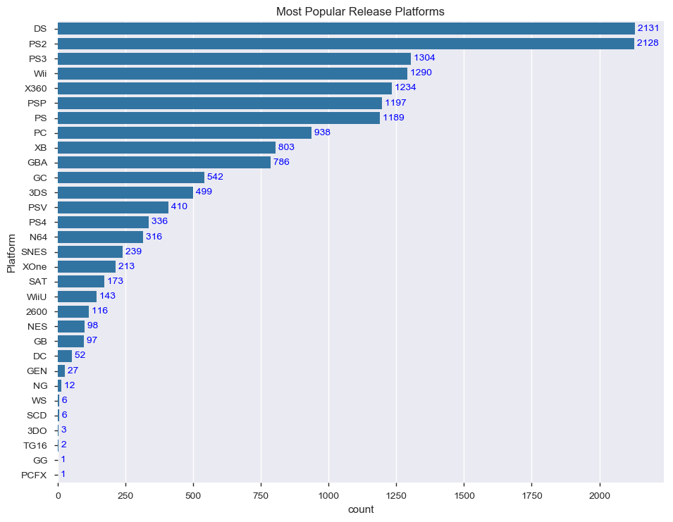


From the above graph, you can see that the most popular platform for releasing games has been the DS and Playstation 2 by a large margin. Behind these two, the most popular platforms were the PS3, Wii, Xbox 360, PSP, and the original Playstation.

Additionally, I also want to see if the number of release platforms has changed over the years.


```python
# Creating bar chart showing Number of Platforms over time
my_cmap = ListedColormap(sb.color_palette()[0])
df.groupby('Year').Platform.nunique().plot(kind='bar', fontsize = 10, width = 0.8, figsize = (10, 6), colormap = my_cmap)
plt.ylabel('Number of Platforms', fontsize = 11)
plt.xlabel('Year', fontsize = 11)
plt.title('Number of Platforms per Year', fontsize = 13);
```


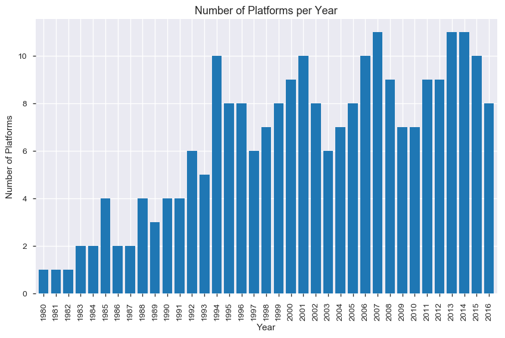


From the above bar chart, we can see that the number of gaming platforms has generally increased over the years, with the number of platforms more drastically increasing in 1994.

Next, I want to look at the most popular platforms by global sales.

>**Note:** Just to reiterate the **'Sales'** variable description given at the beginning, all sales figures throughout the notebook are in terms of **"units sold"**, not in terms of revenue or currency.


```python
# Creating the plot of most popular platforms by global sales
my_cmap = ListedColormap(sb.color_palette()[0])
df.groupby('Platform').Global_Sales.sum().sort_values().plot.barh(fontsize = 10, width=0.8,colormap=my_cmap)
plt.title('Most Popular Platform by Global Sales',fontsize = 13)
plt.xlabel('Global Sales (millions)',fontsize = 11)
plt.ylabel('Platform',fontsize = 11)

# Adding annotations
y = df.groupby('Platform').Global_Sales.sum().sort_values().round(0).astype(np.int64)
for i, v in enumerate(y):
    plt.text(v, i, " "+str(v), color='blue', va='center')
    
# Adjusting margins for better visibility
plt.subplots_adjust(right=1.2, top=1.3);
```


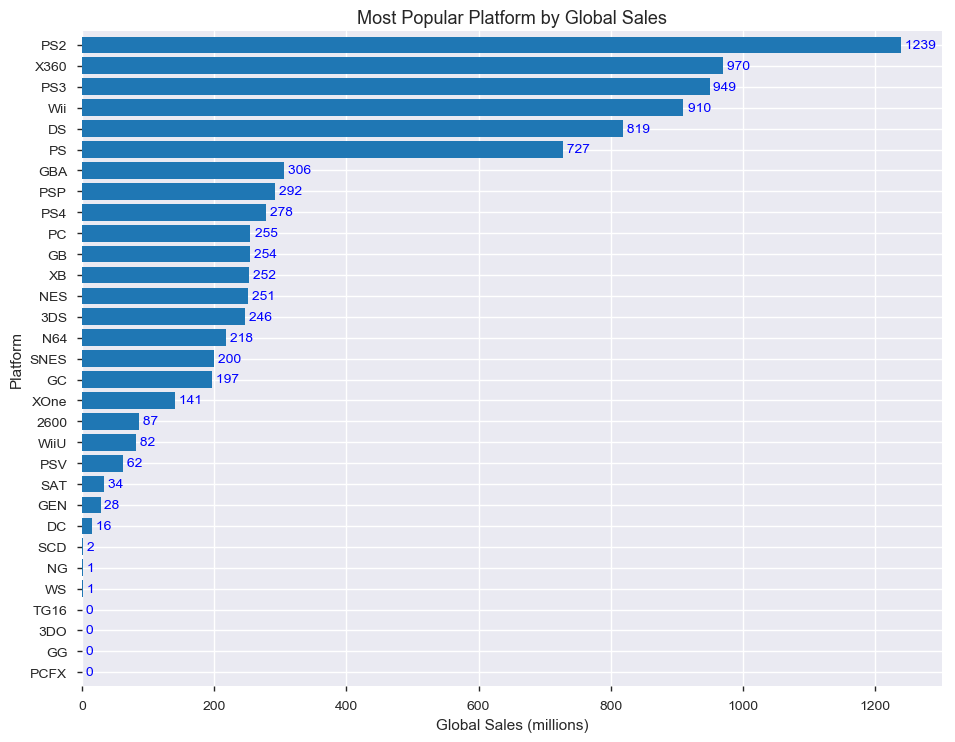


From the above chart, we can see that the **PS2** was the most successful platform in terms of sales by a wide margin. This contrasts with the **PS2** and **DS** being almost tied in terms of the number of releases, as seen in the **'Most Popular Release Platforms'** graph. Though the **DS** led the pack in terms of number of games released, it only placed 5th overall in terms of sales, meaning its games sold less units on average when compared to the **PS2**.

### Year

Next, I want to see how game releases have changed over the years.


```python
# Plotting Year histogram
bin_edges = np.arange(df['Year'].min(), df['Year'].max()+1, 2)
plt.hist(data = df, x = 'Year', bins = bin_edges)
plt.xlabel('Year')
plt.ylabel('Count')
plt.title('Released Year Histogram');
```


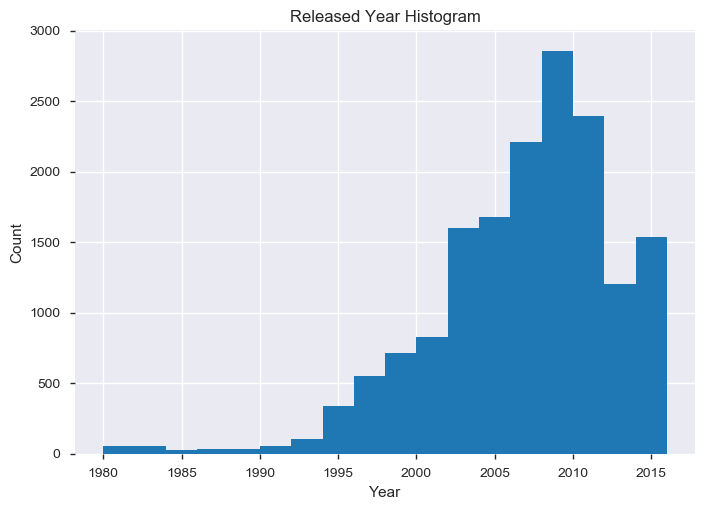


As can be seen in the above graph, it appears that the bulk of games were released from the early 2000's onward.

>**Note:** Based on our previously generated **'Number of Platforms per Year'** graph, it should be noted that the extremely low number of released games during the years before 1995 is most likely partly due to the relatively low number of available platforms during those same years. From the **'Number of Platforms per Year'** graph, we saw that the number of available platforms didn't drastically increase until 1994.

Additionally, I also want to see if there's any noticeable difference if I were to run the same analysis with only unique game titles.


```python
# Plotting Year histogram using unique game titles
bin_edges = np.arange(unique_games['Year'].min(), unique_games['Year'].max()+1, 2)
plt.hist(data = unique_games, x = 'Year', bins = bin_edges)
plt.xlabel('Year')
plt.ylabel('Count')
plt.title('Released Year Histogram');
```


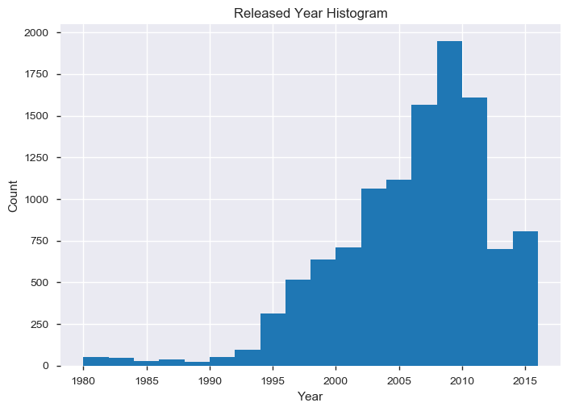


Comparing the above two graphs, there doesn't appear to be any significant notable difference.

### Genre

Now, I want to analyze how the different genres have performed by first looking at the number of game releases per genre.


```python
# Creating the plot of most popular genres
base_color = sb.color_palette()[0]
cat_order = df['Genre'].value_counts().index
sb.countplot(data = df, y = 'Genre', color = base_color, order = cat_order)
plt.title('Most Popular Genres by Number of Releases')

# Adding annotations
y = df['Genre'].value_counts()
for i, v in enumerate(y):
    plt.text(v, i, " "+str(v), color='blue', va='center')

# Adjusting margins for better visibility
plt.subplots_adjust(right=1.2, top=1.3);
```


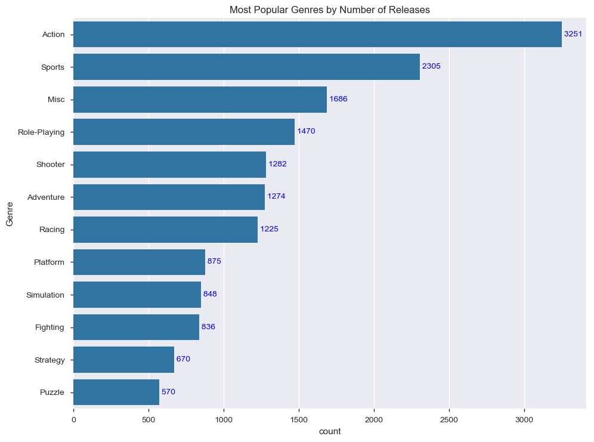


From the above, it appears that the **'Action'** and **'Sports'** genres were the most popular by a fair margin, with the **'Puzzle'** genre placing at the bottom. However, I also wanted to see if there were any significant differences if we were to only look at unique game titles.


```python
# Creating the plot of most popular genres using unique game titles
base_color = sb.color_palette()[0]
cat_order = unique_games['Genre'].value_counts().index
sb.countplot(data = unique_games, y = 'Genre', color = base_color, order = cat_order)
plt.title('Most Popular Genres by Number of Releases')

# Adding annotations
y = unique_games['Genre'].value_counts()
for i, v in enumerate(y):
    plt.text(v, i, " "+str(v), color='blue', va='center')

# Adjusting margins for better visibility
plt.subplots_adjust(right=1.2, top=1.3);
```


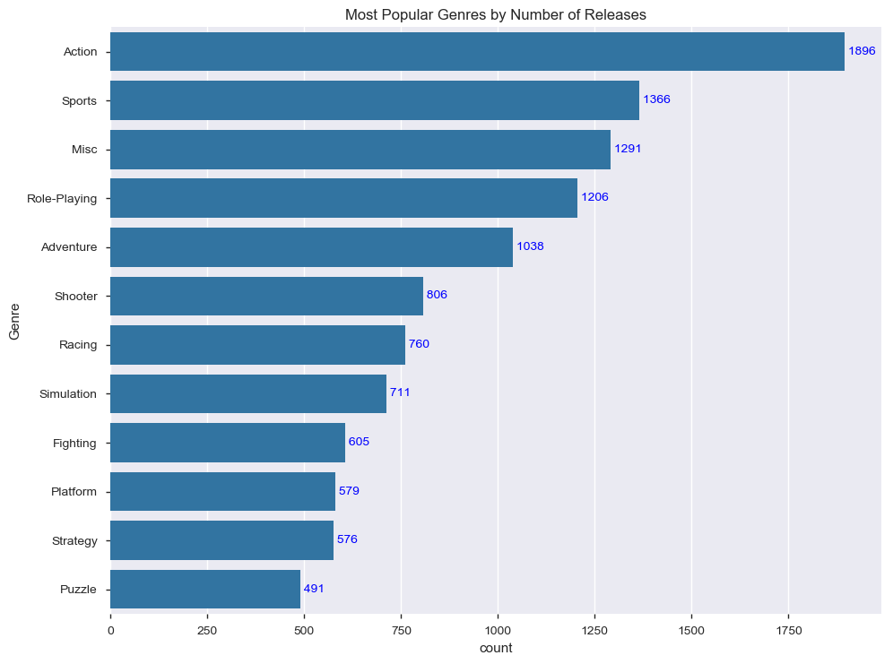


From what I can see, the biggest difference when using only unique game titles is that the **'Shooter'** and **'Adventure'** genres (**5th** and **6th** respectively in the first graph) switched places in the second graph. Otherwise, the rankings (especially near the top) remain mostly the same.

These changes can be more easily seen the graph below:


```python
# Creating clustered bar graph of both the original dataset and the dataset of unique games
graph_df = df['Genre'].value_counts().rename('df').to_frame()\
            .join(unique_games['Genre'].value_counts().rename('unique_games').to_frame())

graph_df.plot(kind='bar', figsize=(10,6))
plt.title('Most Popular Genres - Total vs. Unique Titles')
plt.xlabel('Genre')
plt.ylabel('Count');
```


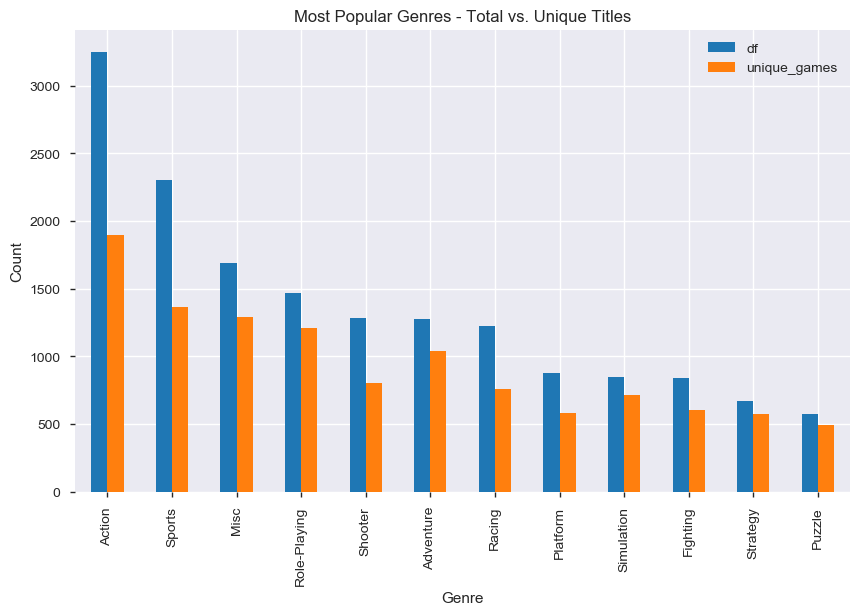


Next, I want to explore how the genres have grown in popularity over the years in terms of number of releases, using the **'unique_games'** dataframe.


```python
# Creating Ridgeline Plot
group_count = unique_games.groupby(['Genre']).count()
group_order = group_count.sort_values(['Year'], ascending = False).index

g = sb.FacetGrid(data = unique_games, row = 'Genre', height = 1, aspect = 10, row_order = group_order)
g.map(sb.kdeplot, 'Year', shade=True)

g.set(yticks=[])

g.set_titles('{row_name}');
```


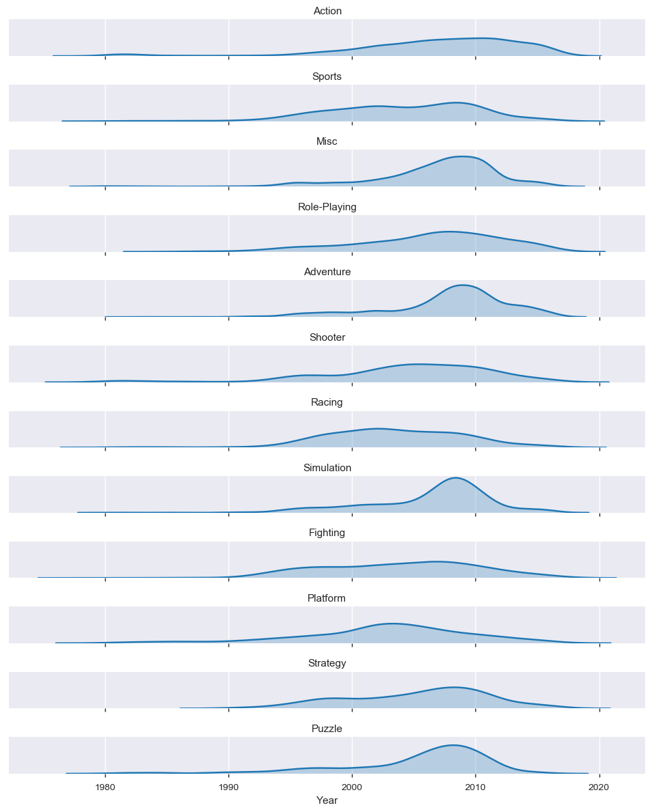


From the above ridgeline plot, we can see that the most popular genre, **'Action'**, didn't start becoming more popular until a little before the year 2000, unlike other genres that look to have had earlier and/or long-term prominence, such as **'Sports'**, **'Racing'**, **'Fighting'**, and **'Platform'** games. Additionally, it appears that the **'Action'** genre's popularity slightly peaked around 2010; however, it's overall popularity distribution appears relatively smooth, when compared to other genres such as **'Adventure'**, **'Simulation'**, and **'Puzzle'**, which all seem to have a clear peak (and subsequent dropoff) around 2008.

In addition to analyzing genre popularity in terms of the number of games released, I also want to see which genres have been most popular in terms of global sales in general.


```python
# Creating the plot of the genres by global sales
my_cmap = ListedColormap(sb.color_palette()[0])
df.groupby('Genre').Global_Sales.sum().sort_values().plot.barh(fontsize = 10, width=0.8,colormap=my_cmap)
plt.title('Most Popular Genres by Global Sales',fontsize = 13)
plt.xlabel('Global Sales (millions)',fontsize = 11)
plt.ylabel('Genre',fontsize = 11)

# Adding annotations
y = df.groupby('Genre').Global_Sales.sum().sort_values().round(0).astype(np.int64)
for i, v in enumerate(y):
    plt.text(v, i, " "+str(v), color='blue', va='center')
    
# Adjusting margins for better visibility
plt.subplots_adjust(right=1.2, top=1.3);
```


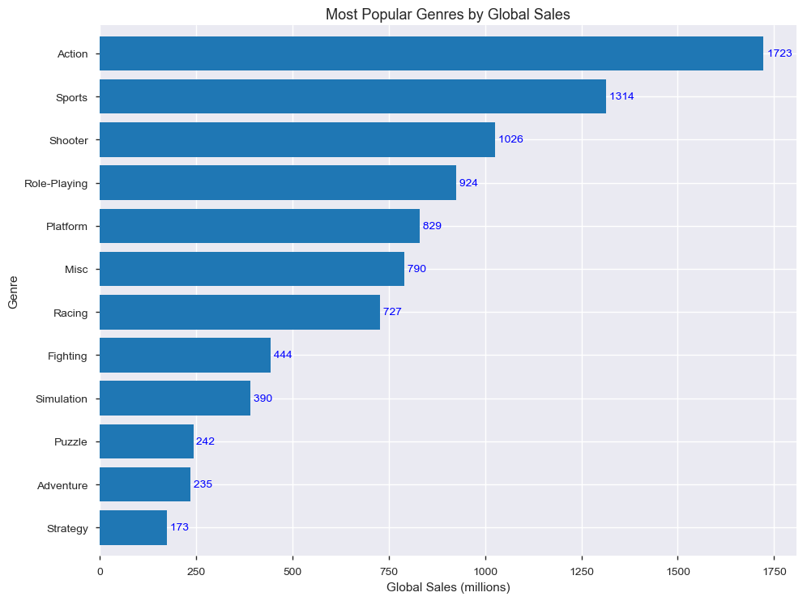


When comparing the above graph to the **'Most Popular Genres by Number of Releases'** graph (reproduced below for easier comparison), we see that the **Action** and **Sports** genres remain the most popular with a similarly proportional lead over the others. Meanwhile, the mid-ranked and low-ranked genres remained mostly in the same tiers, with only some movement up and down.


```python
# Reproducing 'Most Popular Genres by Number of Releases' graph for easier comparison
base_color = sb.color_palette()[0]
cat_order = df['Genre'].value_counts().index
sb.countplot(data = df, y = 'Genre', color = base_color, order = cat_order)
plt.title('Most Popular Genres by Number of Releases')

y = df['Genre'].value_counts()
for i, v in enumerate(y):
    plt.text(v, i, " "+str(v), color='blue', va='center')

plt.subplots_adjust(right=1.2, top=1.3);
```


Next, I want to look at how the genres performed in terms of sales in the different regions.


```python
# Creating clustered bar chart displaying regional sales for each genre
pd.concat(
    [df.groupby('Genre').NA_Sales.sum(), df.groupby('Genre').EU_Sales.sum(),
    df.groupby('Genre').JP_Sales.sum(), df.groupby('Genre').Other_Sales.sum()],
    axis=1).plot.bar(width=0.8, figsize=(10,6))
plt.ylabel('Sales (millions)')
plt.title('Regional Sales per Genre');
```


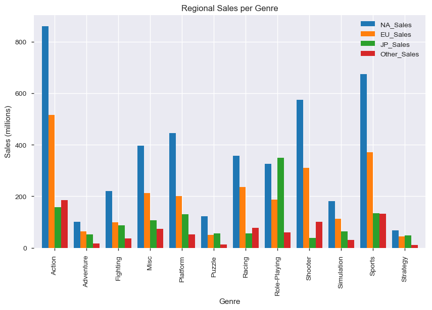


From the above chart, we can see multiple things:
- For every genre, except **'Role-Playing'**, NA sales top the other regions
- The NA and EU regions are consistently the top two regions by sales volume for most genres
- The **'Role-Playing'** genre is clearly strongest in Japan, while also being that regions most popular genre
- The most popular genre in the NA and EU regions is the **'Action'** genre

Additionally, I also want to see how the different genres have performed over the years in terms of Global Sales.


```python
# Creating heatmap of global sales by year and genre
total = df.groupby(['Genre', 'Year']).Global_Sales.sum().round(2)
total = total.reset_index(name = 'Global_Sales')
total = total.pivot(index = 'Year', columns = 'Genre', values = 'Global_Sales')
plt.figure(figsize=(10,8))
sb.heatmap(total, annot = True, fmt = '.2f', cmap = 'Blues', cbar_kws = {'label': 'Global Sales (millions)'})
plt.xticks(rotation = 70)
plt.title('Global Sales by Genre and Year');
```


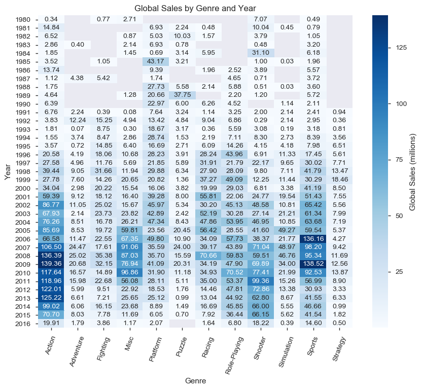


From the above heatmap, we can see that though the **'Action'** and **'Sports'** genres both lead the pack in terms of Global Sales (as has been discovered in previous graphs), the **'Action'** genre has remained dominant for a much longer period of time (including up to recent years). Additionally, we can see that in terms of sales, the **'Sports'** genre has started to fall off a bit in recent years, with the **'Shooter'** genre becoming the second most successful genre.

### Publisher

Next, I want to take a closer look at the Publisher data.


```python
df['Publisher'].nunique()
```


    576


Due to the high number of unique Publishers in the dataset, I will be limiting the number of publishers shown in the chart to only the top 25.


```python
# Creating the plot of the biggest publishers by games released
base_color = sb.color_palette()[0]
cat_order = df['Publisher'].value_counts().iloc[:25].index
sb.countplot(data = df, y = 'Publisher', color = base_color, order = cat_order)
plt.title('Biggest Publishers by Number of Games Released')

# Adding annotations
y = df['Publisher'].value_counts().iloc[:25]
for i, v in enumerate(y):
    plt.text(v, i, " "+str(v), color='blue', va='center')

# Adjusting margins for better visibility
plt.subplots_adjust(right=1.2, top=1.3);
```


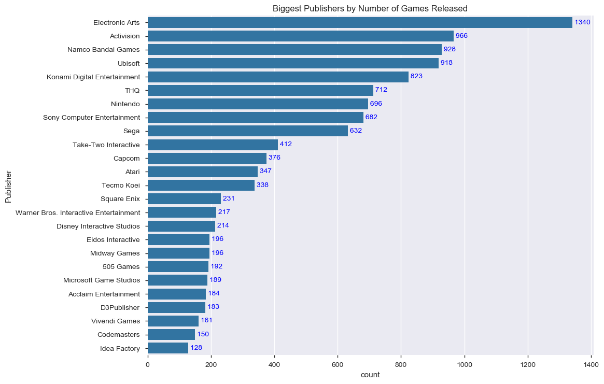


From the above graph, it appears **Electronic Arts** leads the pack by a large margin, in terms of the number of games released, with the next 8 publishers being relatively close.

Next, I want to also analyze them by global sales volume.


```python
# Creating the plot of the biggest publishers by global sales
my_cmap = ListedColormap(sb.color_palette()[0])
df.groupby('Publisher').Global_Sales.sum().sort_values(ascending=False).iloc[:25].sort_values().plot.barh(fontsize = 10, width=0.8,colormap=my_cmap)
plt.title('Biggest Publishers by Global Sales',fontsize = 13)
plt.xlabel('Global Sales (millions)',fontsize = 11)
plt.ylabel('Publisher',fontsize = 11)

# Adding annotations
y = df.groupby('Publisher').Global_Sales.sum().sort_values(ascending=False).iloc[:25].sort_values().round(0).astype(np.int64)
for i, v in enumerate(y):
    plt.text(v, i, " "+str(v), color='blue', va='center')
    
# Adjusting margins for better visibility
plt.subplots_adjust(right=1.2, top=1.3);
```


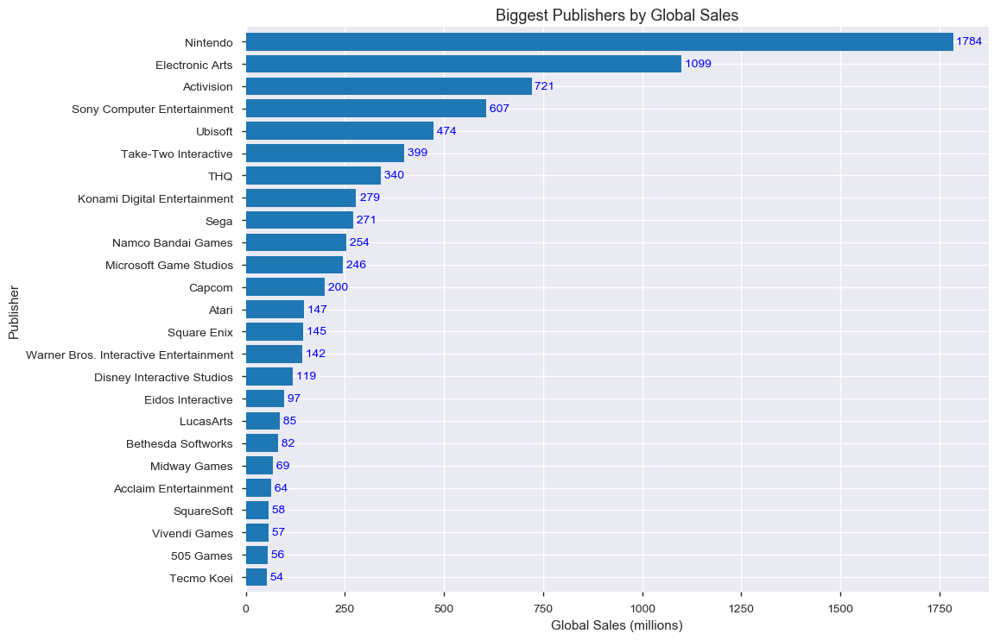


From the above chart, we can see that in terms of global sales, **Nintendo** clearly leads the market by a wide margin. Additionally, since they only placed 7th in the **'Biggest Publisher by Number of Games Released'** graph, we can conclude that even though they only release around half the games **Electronic Arts** did, each of their games did much better on average, which will be confirmed below.


```python
EA_avg_sales = df.query('Publisher == "Electronic Arts"').Global_Sales.sum() / df.query('Publisher == "Electronic Arts"').Publisher.count()
EA_avg_sales = EA_avg_sales.round(2)
Nintendo_avg_sales = df.query('Publisher == "Nintendo"').Global_Sales.sum() / df.query('Publisher == "Nintendo"').Publisher.count()
Nintendo_avg_sales = Nintendo_avg_sales.round(2)
print('Electronic Art\'s average sales per game is: '+str(EA_avg_sales)+' million'+'\n'
      +'Nintendo\'s average sales per game is: '+str(Nintendo_avg_sales)+' million')
```

    Electronic Art's average sales per game is: 0.82 million
    Nintendo's average sales per game is: 2.56 million
    

Due to **Electronic Arts** and **Nintendo** being the leaders by a wide margin in the two respective graphs above, I want to take a closer look at them next.


```python
# Creating Electronic Arts and Nintendo only dataframes for analysis
ea_df = df.query('Publisher == "Electronic Arts"').copy()
nintendo_df = df.query('Publisher == "Nintendo"').copy()
```


```python
# Creating clustered bar chart of Electronic Arts and Nintendo releases
graph_df = ea_df['Year'].value_counts().sort_index().rename('Electronic_Arts').to_frame()\
            .join(nintendo_df['Year'].value_counts().sort_index().rename('Nintendo').to_frame())

graph_df.plot(kind='bar', figsize=(10,6), width = 0.8)
plt.title('Electronic Arts vs. Nintendo Release Count')
plt.xlabel('Year')
plt.ylabel('Count');
```


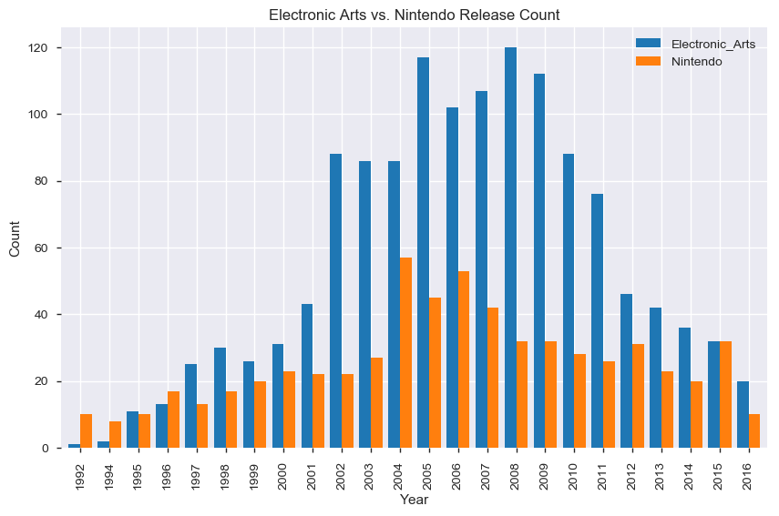


```python
# Creating clustered bar chart of Electronic Arts and Nintendo Global Sales
graph_df = ea_df.groupby('Year').Global_Sales.sum().rename('Electronic_Arts').to_frame()\
            .join(nintendo_df.groupby('Year').Global_Sales.sum().rename('Nintendo').to_frame())

graph_df.plot(kind='bar', figsize=(10,6), width = 0.8)
plt.title('Electronic Arts vs. Nintendo Global Sales')
plt.xlabel('Year')
plt.ylabel('Global Sales (millions)');
```


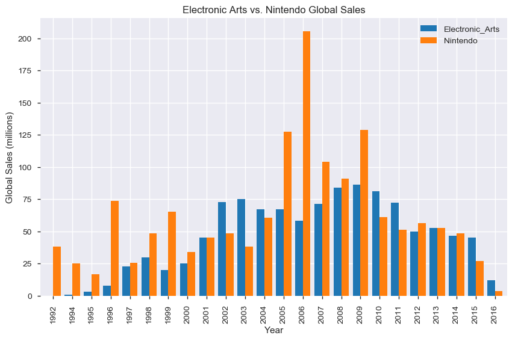


From the above two graphs, we can see that both **Electronic Arts (EA)** and **Nintendo** follow a similar overall trend. Releases and sales generally started to increase in the early 2000's, with the peaks happening in the mid-late 2000's, followed by a general dropoff as we got closer to present day.

Additionally, the two graphs illustrate the conclusions we came to previously, over a time series. In the first graph, we see that **EA** has consistently released far more games than **Nintendo** over the years. However, though the second graph helps reinforce the fact that **Nintendo** generally has more sales on average, the two publishers are actually much more competitive for many of the sales years than the overall average sales per game would suggest.

Looking at the last 7 years of the Global Sales graph, **EA** has been especially competitive with **Nintendo**, actually beating **Nintendo** in the last two years of data. Additionally, we can see that **EA** also beat **Nintendo** in terms of sales multiple times in the preceding years as well. Thanks to the Global Sales time series graph, we can see that the overall average sales per game for **Nintendo** may have been skewed higher due to two particularly strong sales years during 2005-2006. 

Due to the unusually high **Nintendo** sales number for 2006 (a little over 200 million units), I want to look closer at that year's **Nintendo** games to see if there's an explanation for it.


```python
# Showing the top 5 selling Nintendo games for 2006
df.query('Publisher == "Nintendo" & Year == 2006').sort_values(by=['Global_Sales'], ascending=False).iloc[:5]
```


<div>
<table border="1" class="dataframe">
  <thead>
    <tr style="text-align: right;">
      <th></th>
      <th>Rank</th>
      <th>Name</th>
      <th>Platform</th>
      <th>Year</th>
      <th>Genre</th>
      <th>Publisher</th>
      <th>NA_Sales</th>
      <th>EU_Sales</th>
      <th>JP_Sales</th>
      <th>Other_Sales</th>
      <th>Global_Sales</th>
    </tr>
  </thead>
  <tbody>
    <tr>
      <th>0</th>
      <td>1</td>
      <td>Wii Sports</td>
      <td>Wii</td>
      <td>2006</td>
      <td>Sports</td>
      <td>Nintendo</td>
      <td>41.49</td>
      <td>29.02</td>
      <td>3.77</td>
      <td>8.46</td>
      <td>82.74</td>
    </tr>
    <tr>
      <th>6</th>
      <td>7</td>
      <td>New Super Mario Bros.</td>
      <td>DS</td>
      <td>2006</td>
      <td>Platform</td>
      <td>Nintendo</td>
      <td>11.38</td>
      <td>9.23</td>
      <td>6.50</td>
      <td>2.90</td>
      <td>30.01</td>
    </tr>
    <tr>
      <th>7</th>
      <td>8</td>
      <td>Wii Play</td>
      <td>Wii</td>
      <td>2006</td>
      <td>Misc</td>
      <td>Nintendo</td>
      <td>14.03</td>
      <td>9.20</td>
      <td>2.93</td>
      <td>2.85</td>
      <td>29.02</td>
    </tr>
    <tr>
      <th>20</th>
      <td>21</td>
      <td>Pokemon Diamond/Pokemon Pearl</td>
      <td>DS</td>
      <td>2006</td>
      <td>Role-Playing</td>
      <td>Nintendo</td>
      <td>6.42</td>
      <td>4.52</td>
      <td>6.04</td>
      <td>1.37</td>
      <td>18.36</td>
    </tr>
    <tr>
      <th>100</th>
      <td>101</td>
      <td>The Legend of Zelda: Twilight Princess</td>
      <td>Wii</td>
      <td>2006</td>
      <td>Action</td>
      <td>Nintendo</td>
      <td>3.83</td>
      <td>2.19</td>
      <td>0.60</td>
      <td>0.70</td>
      <td>7.31</td>
    </tr>
  </tbody>
</table>
</div>


As you can see from the above, the game **'Wii Sports'** sold almost 83 million units, accounting for almost half of Nintendo's roughly 200 million unit sales in 2006. Upon further research online, it appears that **'Wii Sports'** is unusual, in that it was a title that came free with the newly released Wii console, and is not a standalone title that can be purchased. Given this information, Nintendo's global sales (especially in terms of game sales that generate revenue) can be viewed as being much closer to that of EA than initially thought.

### Sales Over Time

For this next section, I want to dive deeper into the sales data by first analyzing the performance of the different regions over time.


```python
# Creating line graph showing sales by region over time
df[[x for x in df.columns if 'Sales' in x] + ['Year']].groupby('Year').sum().plot()
plt.ylabel('Sales (millions)')
plt.title('Sales Over Time');
```


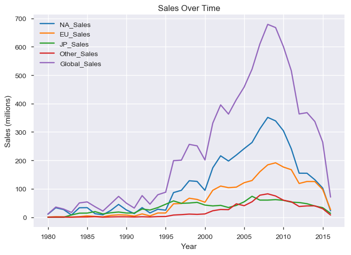


From the above graph, we can see that sales in all regions follow the same general trendline, reaching their sales peak around 2008. However, Japan sales seem to have remained relatively flat over the years, when compared to the other regions. On the otherhand, North American sales are almost an exact mirror of the Global Sales trendline (albeit at a lower volume), while also having the most sales among all the regions. This seems to indicate that North American sales are a major driver of overall Global Sales.

Next, I want to see whether or not the number of games being released over the years affected Global Sales.


```python
# Creating line graph showing sales vs. number of releases over time
df.groupby('Year').Global_Sales.sum().rename('Global Sales (millions)').plot()
df.Year.value_counts().sort_index().rename('Release Count').plot()
plt.legend(loc='best')
plt.ylabel('Units (Sales in millions or Release Count)')
plt.title('Global Sales vs. Number of Releases');
```


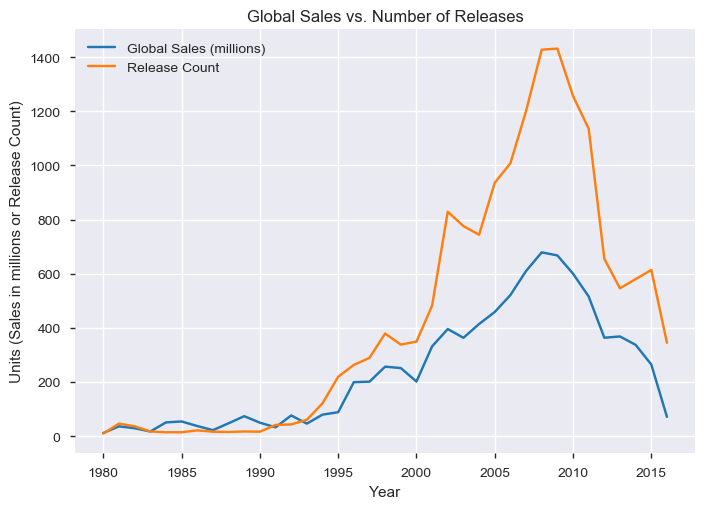


As you can see from the above graph, in the early years (1980 - 1993), **Global Sales** and **Release Count** were pretty closely inline with each other however, they started to pull apart in 1995 as they both started to increase. Though they both followed the same general trajectory over the rest of the years (peaking around 2008), the rate of increase for **Release Count** greatly outpaced that of **Global Sales**, indicating that though more games were being released in general, sales could not keep up. Thus, even though total sales may have been increasing up until 2008, average sales per game were actually down.

## Conclusion

### Platform
- The most popular platforms in terms of game releases were the DS and PS2, while the most popular platform in terms of game sales was the PS2 by a wide margin, with the DS dropping down to 5th place.

### Genre
- Over the years, the **'Action'** and **'Sports'** genres have been the most popular in terms of both the number of releases and global sales.
- The **'Puzzle'** and **'Strategy'** genres have remained at or near the bottom in terms of global sales and number of releases.
- For every genre, except **'Role-Playing'**, NA sales top the other regions.
- The NA and EU regions are consistently the top two regions by sales volume for most genres.
- The **'Role-Playing'** genre is clearly strongest in Japan, while also being that regions most popular genre.
- The most popular genre in the NA and EU regions is the **'Action'** genre.
- The **'Action'** genre has remained dominant in terms of global sales for the longest, lasting until the end of the dataset period coverage.
- In terms of global sales, the **'Sports'** genre has started to fall off in recent years, being overtaken by the **'Shooter'** genre as the second most popular in terms of sales.

### Publisher
- In terms of games released, **Electronic Arts (EA)** is consistently the biggest publisher each year; however, in terms of global sales, **Nintendo** is the biggest, though not consistently when broken down by year.
- Though **Nintendo** is technically the biggest publisher in terms of global sales in aggregate, its global sales were greatly bolstered in 2006 by Wii Sports, a free game that came included with the Wii console platform. In 2006, Wii Sports accounted for almost half of **Nintendo's** global sales for that year.
- In recent years, **EA** has been extremely competitive with **Nintendo** in terms of global sales, actually beating **Nintendo** in the last two years of sales data.

### Sales
- All sales regions followed the same general trendline, peaking around 2008. However, Japan sales remained relatively flat over the years, when compared to the other regions.
- North American sales were almost an exact mirror of the Global Sales trendline, while also having the most sales among all the regions. This seems to indicate that North American sales are a major driver of overall Global Sales.
- In the early years (1980 - 1993), Global Sales and the number of games released were closely inline with each other; however, they started to pull apart in 1995 as they both started to increase.
- The rate of increase for the number of games being released greatly outpaced that of Global Sales, indicating that sales could not keep up. Thus, while total sales may have been increasing up till 2008, average sales per game were actually decreasing.
